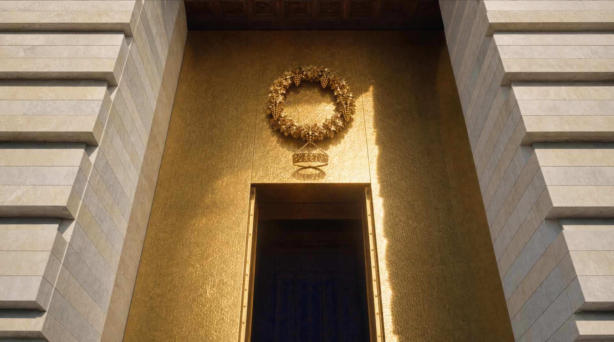
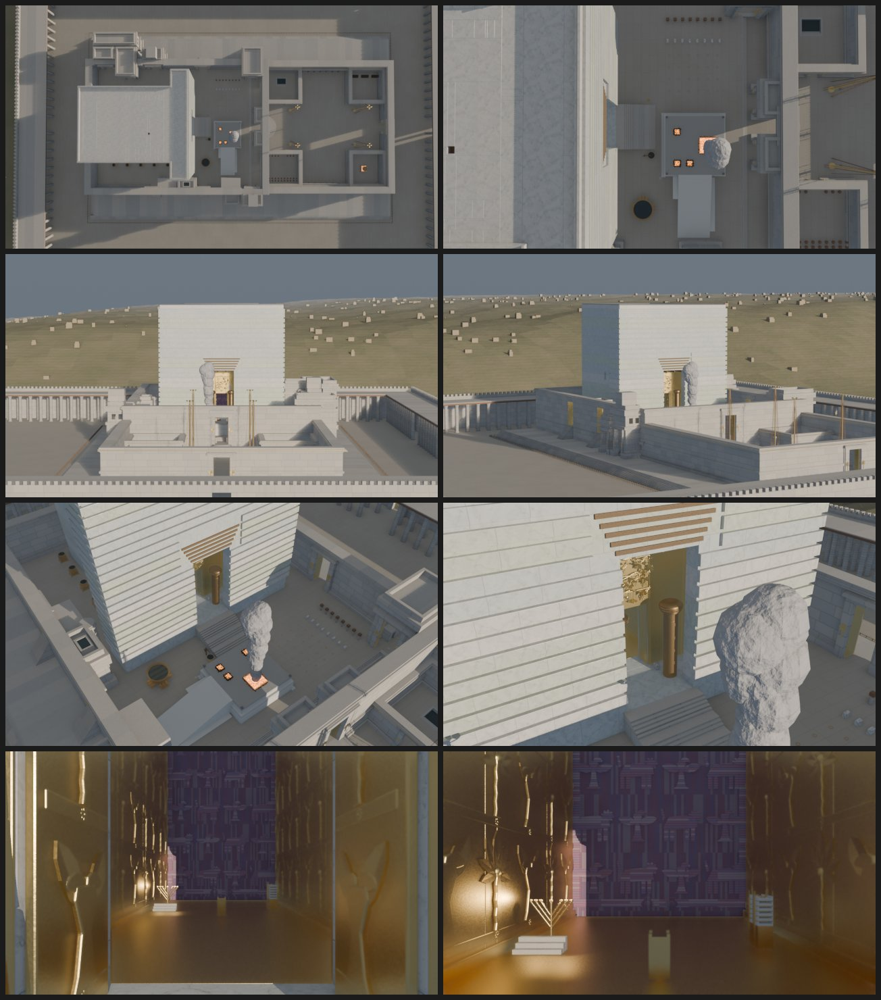

# Beit HaMikdash



Le Beit HaMikdash bâti en volumes, à l'échelle, depuis les sources — puis filmé plan
par plan. Le dépôt donne trois choses : une **scène Blender générée par script**, un
moyen d'y **poser la caméra qu'on veut** et d'en sortir les deux images clés, et de
quoi les **styliser puis les animer** par IA. Ce qu'on tourne avec, personne ne le
décide à votre place : il n'y a aucun découpage figé dans le dépôt.

Le Temple modélisé est celui **à venir**, et il n'est ni le Premier ni le Second : le
plan et les cotes viennent de *Middot*, la seule description mesurée d'un bâtiment
debout, et ce que le Premier Temple avait sans que *Middot* le répète y revient quand le
Tanakh le décrit et que rien ne l'abroge. Dans le Kodesh HaKodashim, l'Arche est de
retour sur l'Even HaShetiya — celle de Moïse, cachée sous le Temple et révélée (*Yoma*
54a ; Rambam *Beit HaBe'hira* 4:1), avec la kaporet et ses deux keruvim (fiche §8h) ;
dans l'Oulam, **Ya'hin et Boaz** sont debout aux cotes de *Melakhim I* 7 (fiche §8a-bis).



*Planche de contrôle — une ligne par plan de `cameras.json`, première image à gauche,
dernière à droite.*

## Fichiers

| Fichier | Rôle |
|---|---|
| `fiche_technique_beit_hamikdash.md` | Référence architecturale : cotes en amot, sources (*Middot*, *Yoma*, *Tamid*, *Pesa'him*, Rambam), matériaux, §9 = liste des erreurs à ne jamais laisser passer. |
| `beit_hamikdash_blockout.py` | Script Blender : génère toute la scène en volumes. **Aucune caméra.** |
| `cameras.json` | Les plans : nom, focale, durée, course de la caméra et course de sa cible, en amot. La source ; le .blend en est l'artefact. |
| `beit_hamikdash_cameras.py` | Pose dans la scène les plans déclarés dans `cameras.json`. |
| `beit_hamikdash.blend` | Scène générée (à regénérer après toute modification du script ou de `cameras.json`). |
| `beit_hamikdash_export.py` | Images clés : planche de contrôle 640 × 360 (`-- --planche`), ou fichiers de production couleur + profondeur 1920 × 1080. Seul script qui sauvegarde le .blend. |
| `beit_hamikdash_analyse_plans.py` | Mesure, plan par plan, ce que les deux frames ont en commun — le chiffre qui décide si un i2v peut tenir le plan. |
| `beit_hamikdash_inspect.py` | Lit la scène sauvegardée et répond : où est un objet, ce qu'une caméra a vraiment dans le cadre. Ne reconstruit rien. |
| `beit_hamikdash_visite.py` | Exporte la scène vers la visite interactive : un maillage par concept, l'emprise de chacun et les points d'entrée. Lit le .blend, ne le réécrit pas. |
| `visite/` | La visite elle-même : page web où l'on marche dans le Temple et où l'on clique un élément pour savoir ce que c'est, avec sa source. |
| `.claude/skills/camera/` | Skill Claude Code + `camera.py` : déclare un plan, en rend les deux images clés et mesure son recouvrement, en une commande. |
| `.claude/skills/blender/` | Skill Claude Code : les incantations headless des six scripts, et l'invariant « le script est la source, le .blend est l'artefact ». |
| `.claude/skills/fal-video/` | Skill Claude Code + `fal_image.py` / `fal_video.py` : stylise une frame clé et génère un plan sur fal.ai en ligne de commande. |
| `.claude/skills/fal-retouche/` | Skill Claude Code + `retouche.py` : corrige un défaut localisé d'une image validée sans regénérer le cadre. |
| `.claude/skills/mikdash/` | Skill Claude Code : banque de sources (*Middot*, *Tamid*, *Yoma*, Rambam) pour répondre cote en main plutôt que de mémoire. |
| `renders/` | Sorties, une étape du pipeline par dossier — voir ci-dessous. |
### Le dossier `renders/`

Un dossier par étape, et rien à la racine :

| Dossier | Étape | Contenu |
|---|---|---|
| `renders/blockout/` | 1 | rendus Blender 1920 × 1080 : `<caméra>_{debut,fin}.png` et `..._profondeur.png`. Ce sont les entrées de l'i2i. |
| `renders/planche/` | 1 | planche de contrôle 640 × 360 + `planche.html` : première et dernière image de chaque plan, avec focale et frames. `planche.jpg` les assemble en une mosaïque. |
| `renders/style/` | 2 | images clés stylisées (`fal_image.py`). |
| `renders/video/` | 4 | les mp4 (`fal_video.py`). |

Le dossier est ignoré par git : ce sont des artefacts, ils se regénèrent. Seule
exception, `renders/planche/planche.jpg`, versionnée pour s'afficher en tête de ce README.

L'export **remet `render.filepath` à vide avant de sauvegarder** le .blend. Sans quoi
n'importe quel rendu d'animation lancé ensuite déverse ses frames dans le dernier
dossier rendu, sous le nom du dernier fichier suffixé du numéro d'image.

### Le dossier `visite/`

Une page web où l'on marche dans le Temple à hauteur d'homme et où l'on clique un
élément pour obtenir sa fiche : nom hébreu, cotes en amot, et la source, en lien vers
le passage sur Sefaria. Le film montre le Temple ; la visite le laisse regarder.

| Fichier | Rôle |
|---|---|
| `visite/index.html` | La page. Aucune dépendance locale : three.js est chargé depuis un CDN. |
| `visite/visite.js` | Scène, marche, collisions, regard, désignation. |
| `visite/pilotage.js` | Les commandes : clavier au bureau, manche du pouce gauche et regard du pouce droit au doigt. |
| `visite/initiation.js` | Les premiers pas : regarder, avancer, quitter le sol, monter et redescendre, interroger un élément — chaque geste montré là où il se fait et validé quand le visiteur l'a fait. Au premier passage, et depuis le « ? » de la barre. |
| `visite/fiche.js` | La fiche d'un concept : panneau latéral au bureau, tiroir à deux crans au doigt, et les liens Sefaria. |
| `visite/qualite.js` | Le profil de rendu — ombres, occlusion, grain, définition — selon ce que la machine tient. |
| `visite/matieres.js` | Les matières : l'appareil de pierre écrit en coordonnées de monde comme dans Blender, et les nappes photographiques posées par-dessus. |
| `visite/nappes.js` | Les cinq jeux de scans, chargés en 1024 sur toutes les machines. |
| `visite/matieres/` | Les scans eux-mêmes, en 1024. Artefacts — `beit_hamikdash_nappes.py` les refabrique. |
| `visite/ciel.js` | Le ciel : d'où vient la lumière, ce que le métal réfléchit, ce qui éloigne les plans. |
| `visite/chaine.js` | La chaîne d'image : occlusion ambiante aux deux échelles, halo, anti-crénelage, étalonnage. |
| `visite/ombres.js` | La carte d'ombre et sa pénombre, qui s'élargit avec la distance au bloqueur. |
| `visite/concepts.json` | **La charnière.** Un concept par entrée : son identifiant, sa zone, et les préfixes de noms d'objets Blender qui lui appartiennent. |
| `visite/contenu_a.json`, `_b`, `_c` | L'encyclopédie : résumé, cotes, sources. Trois fichiers parce qu'ils ont été relevés en trois passes ; le viewer les fusionne au chargement. |
| `visite/contenu_a.en.json`, `.he.json`… | Les traductions de l'encyclopédie, un miroir par fichier et par langue. Le français fait foi. En hébreu, une citation est le texte original relevé sur Sefaria, jamais une retraduction du français. |
| `visite/textes.json` | Par langue : son nom, son sens d'écriture, les textes de l'interface, les zones, les points d'entrée et les titres des œuvres citées. |
| `visite/langue.js` | La langue : le choix au premier passage, retenu dans le navigateur, et le sélecteur à drapeau de la barre. |
| `visite/memoire.js` | Ce que le navigateur retient d'une visite à l'autre — la langue, l'initiation suivie —, sans casser quand le stockage est refusé. |
| `visite/temple.glb` | Géométrie exportée, compressée meshopt : 6,7 Mo pour 746 000 triangles. Artefact — se regénère. |
| `visite/reperes.json` | Emprise de chaque concept, points d'entrée du menu, et points des creux souterrains que seul « Un élément… » atteint. Artefact. |

```bash
$BLENDER -b beit_hamikdash.blend -P beit_hamikdash_visite.py   # regénère temple.glb
cd visite && python3 -m http.server 8777                       # puis http://127.0.0.1:8777/
```

Un serveur est nécessaire : la page est un module ES, `file://` ne la charge pas.

**En ligne.** `./publier_visite.sh [chemin-du-site]` recopie la visite dans
`public/visite/` du dépôt `davidbonan.com` (le voisin, par défaut) et y ajoute la
balise `<base>` dont la page a besoin pour être servie à `/visite`, sans slash final.
Le commit dans ce dépôt-là déclenche Netlify : https://davidbonan.io/visite
`?qualite=basse` force le profil léger depuis un bureau — c'est ainsi qu'on vérifie le
rendu du téléphone sans téléphone sous la main ; `?qualite=haute` fait l'inverse.

**Au doigt.** Le pouce gauche pose un manche là où il touche et marche à la course du
pouce ; pousser au-delà du cercle, c'est courir. Le pouce droit tourne la tête. Un
appui bref interroge l'élément touché, deux appuis brefs s'y rendent — le pilote
automatique pousse le marcheur avec la même commande qu'un pouce, donc les mêmes murs
l'arrêtent. La fiche monte alors du bas en deux crans, l'aperçu laissant voir l'élément
dont elle parle ; en paysage, où c'est la hauteur qui manque, elle redevient un panneau
latéral. Le champ de vision est fixé à l'horizontale et non à la verticale : un champ
vertical constant vaut 94° de large en 16/9 et 31° sur un téléphone tenu debout.

**La matière.** Le blockout n'a pas d'UV — `export_texcoords=False` — et n'en aura pas :
ses volumes sont refusionnés par concept à chaque export, et aucun dépliage n'y
survivrait. Tout se pose donc sur la position de MONDE, en projection triplanaire, et
sur le seul nom de la matière exportée. Trois couches se superposent : l'appareil est
*écrit* — assises de 4 amot, joints creusés, rangées du dallage, tout ce qui a une cote
et une source —, la nappe photographique porte le grain, et une seconde échelle cinq
fois plus lente casse la répétition du carreau.

La photo n'apporte jamais sa couleur, seulement son ÉCART : elle est appliquée en
rapport à sa propre moyenne, et son chroma est bridé famille par famille. Sans ce frein,
le dallage de l'Azara se couvrait des lichens verts du calcaire scanné. La teinte reste
ce que Blender et les bancs du meleke ont décidé — c'est aussi ce qui fait qu'une
retouche dans la scène ne demande jamais de retoucher une image.

Six jeux, tous CC0, refabriqués par `beit_hamikdash_nappes.py` : *worn_rock_natural_01*,
*beige_wall_001*, *hinoki_planks* et *rough_linen* de [Poly Haven](https://polyhaven.com),
*Metal007* et *Marble001* d'[ambientCG](https://ambientcg.com). 2,3 Mo en 1024, téléphone compris. L'or
n'en tire que son terni : une feuille BATTUE a des creux, et
une tôle scannée n'en a pas — le martelage est écrit, comme l'appareil.

**Les arêtes.** Le blockout porte 5 561 chanfreins, que l'export jetait tous. Les six
collections qu'on longe à bout de bras — Mizbea'h, Oulam, Heikhal, Kodesh HaKodashim,
Aron, kelim — les gardent maintenant, à UN segment : une pierre de taille a un arêtier,
pas un congé, et c'est aussi moitié moins cher. Le reste garde ses arêtes vives : à
l'enceinte ou à la ville, on ne s'approche jamais assez pour que 3 cm se voient.
La facture est de 272 000 à 746 000 triangles et de 2,7 à 6,7 Mo — mais 0,4 ms sur 8,7
au rendu, mesuré ici : ce chanfrein coûte du poids, pas des images.

**La lumière.** Ce qui restait de « vieille 3D » ne tenait plus à la matière mais à la
formation de l'image. Quatre choses, mesurées avant d'être crues.

Le soleil était à **38°** au-dessus de l'horizon : il éclairait les surfaces au lieu de
les raser, et tout le relief acquis — assises, joints, chanfreins, grain des nappes —
recevait la même clarté. Il est à **20°**, et rien ne coûte moins cher qu'un vecteur.
Plus bas encore, le dallage ne recevrait plus qu'un quart du soleil et l'ambiance
reprendrait le dessus ; le rapport soleil/ciel est donc rouvert en même temps (3,1 contre
0,30) et le soleil réchauffé, comme le fait l'atmosphère qu'il traverse plus longuement.

Le brouillard commençait à **220 m**. Dans l'Azara rien n'est à plus de soixante : son
facteur valait exactement zéro sur toute vue de cour, un mur à quarante mètres avait le
contraste d'une marche à deux, et l'œil lisait une maquette. Il commence à **six mètres**,
et il n'a pas la même couleur des deux côtés du ciel — la brume diffuse vers l'avant :
regardée dans l'axe du soleil elle est claire et ambrée, dos à lui plus froide que le ciel
qui la nourrit. C'est cet écart qui fait lire une distance, pas le voile.

L'environnement que le métal réfléchissait n'avait **pas de soleil** : un dégradé à trois
couleurs, sans disque et sans horizon franc. Un métal dont le reflet ne contient aucune
image se lit en plastique jaune, et c'est ce que l'or rendait. Le dôme d'éclairage porte
maintenant un soleil ÉLARGI à trois degrés — un demi-degré ne couvre pas un texel de la
cube-map et ne survit pas au filtrage PMREM — et un horizon resserré, les deux seules
choses qu'un métal doit réfléchir pour en être un.

Enfin, `antialias: true` sur le moteur ne servait à **rien** : il ne vaut que pour le
tampon d'écran, dans lequel la chaîne de post-traitement n'écrit jamais. Toute la visite
sortait crénelée. L'anti-crénelage est passé en fin de chaîne, après le tonemapping :
un multi-échantillonnage de la cible du composeur coûterait 165 Mo sur un écran retina et
ne dirait rien du crénelage qui ne vient pas de la géométrie — celui de l'occlusion,
calculée en demi-résolution, ou celui du disque solaire.

**Le contact, la pénombre, le grain.** Ce qui précède corrigeait des fautes. Ce qui suit
est ce qui fait lire une photographie, et rien de tout cela ne se remarque une fois là :
on remarque son absence.

L'occlusion ambiante avait UN rayon, 1,8 m. Il dit « ce coin est un coin » ; il ne dit
rien du pli de trois centimètres où la contremarche rencontre le giron, où le fût pose
sur sa base, où court le joint d'une assise — et sans ce trait-là deux surfaces qui se
touchent restent deux aplats posés l'un contre l'autre. Un **second rayon de 8 cm**
partage les directions du premier : la seconde échelle ne coûte qu'une prise de plus par
direction. Il s'éteint dès 12 m, où il vaut moins d'un pixel de la passe en
demi-résolution et où le pas du demi-flottant dépasse le rayon lui-même.

Les ombres portées avaient la même dureté partout : le pied d'une colonne et la crête
d'un mur à quarante mètres y avaient un bord aussi net l'un que l'autre. Le soleil fait
un demi-degré, et l'ombre qu'il porte s'élargit d'un centimètre par mètre séparant
l'objet de ce qui le reçoit. `visite/ombres.js` cherche d'abord ce qui bouche le soleil,
en tire la distance moyenne, et c'est elle qui donne le rayon du filtrage — un contact
reste tranchant, l'ombre d'une façade de cinquante mètres ne l'est plus. three n'offre
pas de point d'entrée : on renomme SA fonction dans son propre morceau de nuanceur, et
le module **échoue bruyamment** si une version future change ce nom, plutôt que de rendre
des ombres dures sans le dire.

Enfin le **grain**, qui ne correspond à rien de physique ici : rien ne le produit, aucune
source ne le demande. Il est là parce que l'absence de grain est ce qui reste de plus
reconnaissable dans une image de synthèse — une surface parfaitement propre n'existe dans
aucune photographie. Avec lui, une bascule de teinte sur la clarté (ombres au froid,
lumières au chaud, ce que le nuanceur de matière fait déjà là où il connaît les deux) et
un vignettage.

**La facture.** Mesurée au `gl.readPixels`, qui force la synchronisation GPU — le
`requestAnimationFrame` est calé sur le balayage à 16,7 ms et ne mesure rien.

| | avant | 1–5 | 1–8 |
|---|---|---|---|
| bureau | 9,0 ms | 9,4 | **11,6** |
| profil léger | 2,6 ms | 3,1 | **3,1** |

La pénombre à elle seule vaut 1,75 ms des 2,6 : vingt-quatre prises dans la carte d'ombre
au lieu de neuf. Le profil léger ne la prend pas et garde le PCF de three.

**Le lien géométrie ↔ encyclopédie.** `concepts.json` déclare, pour chaque concept,
les préfixes de noms d'objets qui le composent — le préfixe le plus long gagne. L'export
fusionne tous les volumes d'un concept en **un seul maillage** portant son identifiant :
les milliers de volumes du blockout deviennent 75 maillages, et le clic tombe sur *le Mizbea'h*
plutôt que sur l'une des cinq boîtes qui font un mur percé.

Corollaire, et c'est la seule discipline à tenir : **un volume ajouté au blockout dont le
nom ne tombe sous aucun préfixe est versé dans `_non_classe`** et devient un maillage
anonyme. L'export l'annonce en fin de course, groupé par racine de nom — cette liste est
exactement ce qu'il reste à déclarer dans `concepts.json`.

**Les langues.** Français, hébreu, anglais : choisies au premier passage, retenues dans
le navigateur, changées au drapeau de la barre. Le français est la source, et la même
discipline vaut pour lui : **tout changement dans `concepts.json` ou `contenu_*.json` se
reporte dans les miroirs `.en` et `.he`**. `python3 beit_hamikdash_traductions.py` dit ce
qui manque ou a dérivé — un concept nouveau, une cote ajoutée, une source changée — et
sort en erreur tant qu'il en reste. Une langue non traduite retombe sur le français.

**Ce que la visite ne prend pas.** Les 5 960 modificateurs Bevel (à appliquer, la scène
passe de 132 000 à 743 000 faces et le fichier de 3,8 à 76 Mo, pour un chanfrein de 3 cm
invisible à hauteur d'homme), les lumières de rendu, le pays, les caméras et la fumée —
mise en scène, pas architecture.

**Les matières.** L'export n'emporte de chaque matière Blender que sa couleur de base :
glTF ne transporte pas de nœuds, et les maillages n'ont aucune UV. `matieres.js` refait
donc le calcul dans le nuanceur, à partir de la même entrée que Blender — la position du
point dans le monde. L'appareil de gazit — blocs de dix et de huit amot (*Melakhim I*
7:10), assises alternées saillante/rentrante (*Baba Batra* 4a), joint creusé et liseré
ciselé — se poursuit ainsi d'un objet au suivant sans saut de motif, exactement comme au
rendu. Une famille par matière, choisie sur son nom ; `banc()` et `BANCS_CALCAIRE`
portent les mêmes valeurs des deux côtés, et une retouche de palette se fait aux deux.

**Aucune dérivée d'écran dans ce fichier, et c'est la règle à ne pas rouvrir.** Elles
s'imposent d'elles-mêmes — pour anticréneler un joint, pour simuler du relief sans UV ni
tangentes, pour retrouver la normale d'une face. Toutes échouent de la même façon : aux
angles rasants, un mur vu presque par la tranche — la moitié des cadres dans un couloir
de 40 amot — deux pixels voisins tombent sur des points du monde très éloignés, la
dérivée explose, et ce qu'elle pilote clignote d'un pixel à l'autre. Le symptôme est une
pierre qui grouille, présente même toutes ombres coupées. La normale vient donc de
l'attribut de sommet (c'est elle qui décide si une face est un sol ou un mur, et sur quel
axe courent les joints), et le détail se fond sur la **distance à l'œil**, qui varie
doucement. Le relief passe par la couleur et la rugosité, pas par la normale : le vrai
relief est déjà modélisé — les rovadim de la façade, le jeu d'assises.

C'est aussi pourquoi l'export emporte les normales (`export_normals=True`) malgré son
coût — 3,8 Mo sans, 14,5 Mo avec : sans elles, ni les matières ni `shadow.normalBias`
n'ont de quoi travailler. Si le fichier devait passer en ligne, le levier est la
compression Draco, pas la suppression des normales.

**Regarder et désigner.** Le regard suit le **glissé**, bouton gauche enfoncé ; relâché,
la souris redevient libre pour la barre du haut et pour la fiche. C'est le contraire du
verrouillage de pointeur, qui rendait ces deux-là inatteignables : l'invite plein écran
que le navigateur impose pour rentrer dans le verrou (`inset: 0`) passait devant la barre
exactement quand le curseur était libre, et avalait le clic. Un déplacement de moins de
5 px reste un **clic** et interroge l'élément sous le curseur — le tir de rayon part de la
souris, plus du centre de l'écran, d'où la disparition du réticule et l'étiquette de survol
accrochée au curseur. Le clavier est neutralisé tant que le focus est dans la barre ou la
fiche, sans quoi une flèche changerait d'entrée dans un menu tout en faisant marcher.

**Se déplacer.** À pied, le Temple ne se laisse traverser que par où il se traversait :
les douze degrés du 'Heil, les quinze marches de Nikanor, et l'autel se contourne. Les
degrés font ½ ama — 0,24 m — et c'est cette valeur qui commande la règle de collision :
la garde se place juste au-dessus de la hauteur franchissable et sa portée reste plus
courte qu'une marche n'est profonde, sinon elle heurte la marche suivante avant qu'on ait
gravi la première. **`V` bascule en vol libre** (`Espace` monter, `C` descendre) : un
modèle se regarde aussi d'où l'on n'a pas le droit de se tenir.

Trois concepts sont traversables : les deux parokhot et les chaînes du Devir — une étoffe
ne barre pas le passage, et une visite qui s'arrête devant la parokhet n'atteint jamais le
Kodesh HaKodashim — et le **Soreg**, pour une autre raison : le blockout le pose continu
sur tout le pourtour, sans les ouvertures qu'il avait (*Middot* 2:3). S'y cogner serait
buter sur un manque du modèle, pas sur l'architecture.

**Ce que la visite a révélé du blockout.** Marcher dans un modèle en éprouve la
continuité, ce qu'aucun rendu de caméra ne fait :

- **Le seuil de Nikanor n'a pas de sol.** `Azara_sol` s'arrête à `AX1`
  (`beit_hamikdash_blockout.py:1500`), les quinze marches montent jusqu'à `AX1 + 5`, et le
  passage de la porte entre les deux — cinq amot sur l'axe même du film — est un vide.
  À pied, on ne peut pas entrer dans l'Azara par Nikanor.
- **Le Soreg n'a aucune ouverture** : ses poteaux se suivent tous les 3 amot sur les
  quatre côtés, y compris sur l'axe est.

**La règle de la fiche technique s'applique ici aussi** : un concept modélisé dont aucune
source n'a été relevée affiche « pas encore documenté », jamais une cote plausible.

## Démarrage

```bash
BLENDER=/Applications/Blender.app/Contents/MacOS/Blender

# la scène seule, pour vérifier que le script tourne (rien n'est sauvegardé)
$BLENDER -b beit_hamikdash.blend -P beit_hamikdash_blockout.py

# la scène, les plans de cameras.json, et la planche de contrôle — le .blend est sauvegardé
$BLENDER -b beit_hamikdash.blend \
    -P beit_hamikdash_blockout.py \
    -P beit_hamikdash_cameras.py \
    -P beit_hamikdash_export.py -- --planche
open renders/planche/planche.html
```

Ou : Blender → onglet *Scripting* → coller le fichier → *Run Script*. Vérifié sur
Blender 5.2 : **9 178 objets** en architecture seule (`FOULE = False`), **18 913** avec
la foule de Yom Kippour. Les marqueurs de timeline changent de caméra automatiquement ;
`Ctrl+Numpad0` pour activer une caméra.

Constantes en tête de fichier : `AMA = 0.48` (Rav 'Haïm Naeh), `MENORA_DROITE` (branches
droites Rambam / courbes), `PORTES_HEIKHAL_OUVERTES` (battants rabattus dans
l'embrasure, comme pendant l'avoda), `FOULE` (peuple, cohanim, Léviim et leurs
instruments), `CANDELABRES_SHOEVA` (les mâts d'or de *Soucca* 5:2 dans l'Ezrat Nashim),
`FPS`.

**La génération prend une vingtaine de secondes** depuis que le pays est bâti (une nappe
de 58 000 sommets, 1 200 maisons, 1 000 oliviers) ; elle en prenait 3 avant.
Elle en prenait une quinzaine de *minutes* tant que le script posait ses volumes avec
`bpy.ops.mesh.primitive_*` : chaque appel d'opérateur réévalue le graphe de
dépendances, et le coût est quadratique en nombre d'objets (mesuré : 0,44 s pour 200
cubes, 11,9 s pour 800, 52,6 s pour 1600). Les volumes se construisent maintenant
directement en `bpy.data`, sommet par sommet, à travers les helpers `box`, `prism`,
`cyl`, `cone`, `sphere`, `tore`, `cyl_between`. **Ajouter une forme, c'est ajouter un
helper, pas un opérateur.**

Le passage aux `bpy.data` a été vérifié plutôt que cru : les objets portaient les mêmes
noms, le même nombre de sommets et de faces, et chaque sommet était à **17 µm au plus**
de celui que posait la primitive (0,000035 ama, sur un bâtiment de 100 amot — c'est la
résolution du float32 à 115 m de l'origine, pas un déplacement). Aucune normale n'est
rentrante, ce qui compte parce que c'est la passe Normal qui conditionne l'i2i.

### Poser un plan

Les caméras ne sont pas dans le script : elles vivent dans `cameras.json`, un objet par
plan — nom, focale, durée, course de l'objectif et course de son point de visée, en
amot. Un seul point ne bouge pas, deux donnent une droite, plus donnent une polyligne.

```bash
python3 .claude/skills/camera/camera.py ajouter --nom CAM_04_Rampe --focale 35 \
    --duree 12 --camera "-38,-62,3" "-38,-57,3" --cible "-38,-28,9"
```

La commande écrit la déclaration, rebâtit la scène, rend les deux images clés du plan
dans `renders/blockout/` et affiche la mesure de recouvrement. `lister`, `rendre` et
`supprimer` complètent le jeu. Détail dans `.claude/skills/camera/SKILL.md`.

### Interroger la scène sans la reconstruire

`beit_hamikdash_inspect.py` ouvre le .blend sauvegardé et répond — pas de
`-P beit_hamikdash_blockout.py` devant, donc pas de reconstruction :

```bash
$BLENDER -b beit_hamikdash.blend -P beit_hamikdash_inspect.py -- --voit CAM_04_Rampe
```

`--scene` (défaut) donne les collections, les plans et l'étendue ; `--objets <motif>`
les bornes en amot d'un objet ; `--camera <plan>` la pose, le champ et la vitesse aux
deux frames clés ; `--voit <plan> [debut|fin]` **ce que le cadre contient vraiment**,
mesuré à la grille de rayons et par part d'écran. C'est cette dernière qui répond aux
questions du type « la fenêtre du Beit Avtinas montre-t-elle la cour » sans y répondre
à l'œil. Le plan se nomme en entier, par son numéro, ou par un fragment de son nom.

Le .blend qu'il lit date du dernier export : `beit_hamikdash_export.py` est le seul
script qui appelle `wm.save_mainfile`.

### Matière et rendu

Le blockout n'est plus en volumes gris : les matières sont **procédurales et lues en
coordonnées de monde** (`Geometry > Position`), donc les assises d'un mur se
poursuivent d'une boîte à la suivante — un mur percé en est fait de cinq. Ce sont
elles, avec le **biseau** posé sur toute l'architecture (1057 modificateurs, 2 segments,
limite à 30°), qui remplissent la passe **Normal** : plate, elle laissait l'i2i
redessiner chaque arête à chaque image.

| Fonction | Ce qu'elle donne |
|---|---|
| `pierre` | calcaire en **assises** de 4 amot, blocs de 8 ou 10 (*Melakhim I* 7:10), chacun tirant son banc (fiche §7), joint creusé et liseré ciselé |
| `enduit` / `enduit_noirci` | chaux des pierres non taillées (*Middot* 3:4) ; noircie au sommet du Mizbea'h par le feu (fiche §5) |
| `dallage` | dallage en **rangées** de 4 amot (*rovadim*), dalles de 8 ou 10 dedans, joint creux — c'est le joint, en lumière rasante, qui donne la fuyante des cours |
| `metal` | or et bronze **vraiment métalliques**, rugosité brouillée au bruit (l'or du Temple est martelé, pas poli) |
| `marbre` | veiné, pour les huit tables du Beit HaMitba'haïm et celle de l'Oulam |
| `marbre_herode` | le corps du bâtiment : **assises** de 8 amot (CHOIX), trois marbres tirés par assise (*Baba Batra* 4a), **poli**, sans liseré ciselé, veiné par le scan *Marble001* recalé sur chaque bloc — le même que la visite (CHOIX) |
| `bois` | cèdre des plafonds (*Melakhim I* 6:9), chêne des maltera'ot (*Middot* 3:7) |
| `etoffe` | bigdei lavan, laine de la foule (quand `FOULE` est vrai) |
| `parokhet` | les deux rideaux : **quatre matières à parts égales en champs de 5 amot** lus en Z du monde — tekhelet, argaman, tola'at shani, lin (*Shekalim* 8:5), lisière sombre entre les champs, relief de deux trames croisées ; aucun fil d'or (Ex. 26:31). Le bleu uni se stylisait en velours à plis |
| `bois_sculpte` | les maltera'ot, « קוֹרוֹת מְצֻיָּרוֹת וּמְכֻיָּרוֹת » (Bartenura sur *Middot* 3:7) : le fil du bois plus un relief de rinceaux en travers |
| `terre` | les collines : roche et garrigue mêlées au bruit, **terrasses** en dents de scie lues en Z (pas de 4 amot), et le **voile** ci-dessous |
| `eau` | l'eau du Kiyor, sombre et lisse |
| `braise` | charbons des ma'arakhot, plus une lampe surfacique sur la grande : l'autel n'était pas allumé. Côté visite, la matière `BRAISE` de `matieres.js` en refait le détail — croûte, cendre et fentes incandescentes |
| `nuee` | proxy de fumée — **opaque à dessein**, il doit écrire la passe Z sur laquelle l'export mesure sa plage |

`_voiler` : perspective atmosphérique **dans la matière** — passé 1500 amot de l'origine, terre, maisons et oliviers se fondent vers la brume du ciel (85 % à 5500). Eevee n'a pas de brouillard sans volume, et un volume sur un pays de six mille amot se paye à chaque frame ; sans le voile, une colline à cinq mille amot rendue au contraste d'un mur à cent se lisait collée sur le Sanctuaire (plan 1).

Volumes : `box`, `cyl`, `cone`, `sphere`, `prism`, `tore`, `cyl_between`, et `revolution` — un profil (rayon, hauteur) tourné autour d'une verticale, paroi extérieure en montant puis intérieure en descendant, pour ce qui est creux (le kaf, le Kiyor). Et `relief` : la nappe du sol naturel, une face par case de 50 amot, cote par `altitude(x, y)`.

Ajouts de géométrie : les colonnes des portiques et de la Stoa ont **base et chapiteau**
(235 chapiteaux), et la nef de la Stoa un **plafond à caissons** (100 poutres) — c'est la
cadence des poutres qui donne sa vitesse à un travelling dans la nef, et elle entre dans la
passe Depth. Puis la passe de finitions du 8/09, détaillée dans « Tranché » : le pays
autour de l'esplanade (relief, ville, oliviers), les portiques couverts et crénelés, le
couronnement des murs, les battants d'or des six portes, le soreg en treillis, la galerie
des femmes sur colonnes, le yessod de *Middot* 3:1, le trait de sikra, les deux petites
rampes, les quatre ma'arakhot en bûches, le Kiyor à douze robinets, les crochets des
ninnasin, les vraies fenêtres du Heikhal, les caissons d'or, les klonsot de l'Oulam, la
vigne palissée, la couronne sur ses chaînes, les pointes du kaleh orev, la Menora à coupes,
boutons et fleurs, les jarres du Beit Avtinas.

Éclairage : soleil d'aube inchangé (4 W/m², 12° au-dessus de l'horizon), fond en
**dégradé de brume** (bleu au zénith, brume près de l'horizon, pas de ligne d'horizon).
Un vrai ciel physique (*Sky Texture*) a été essayé et écarté : mesuré, il éclaire quatre
fois plus, et il assombrit tout ce qui est sous l'horizon — comme rien n'est modélisé
au-delà du Har HaBayit, le Temple s'y lisait posé sur une mer.

Moteur : Eevee avec **ombres, raytracing écran et fast GI** (sans rebond, les intérieurs
tombaient en aplat : le Heikhal n'est éclairé que par la Menora et
quatre fenêtres hautes). Pour les images clés seulement, **`--cycles`** au blockout bascule
en Cycles 128 échantillons, GPU si disponible :

```bash
$BLENDER -b beit_hamikdash.blend \
    -P beit_hamikdash_blockout.py -P beit_hamikdash_cameras.py \
    -P beit_hamikdash_export.py -- --cycles
```

Deux frames par plan, pas la totalité de la timeline : le film ne sort pas de Blender.
Les deux rendus de données par frame (mesure de la plage Z, carte de profondeur)
retombent alors à un seul échantillon — ils ne dépendent pas de l'échantillonnage.
Compter large : sur Metal (M5 Pro), un intérieur en 640 × 360 met déjà ~2 min,
chargement du .blend compris.

Le blockout n'est à rechaîner que si le **script** ou `cameras.json` ont changé :
l'export sauvegarde le .blend, donc pour re-rendre sur la scène déjà générée il suffit
de `-P beit_hamikdash_export.py -- --planche`.

Et la mesure qui va avec — pour chaque plan, ce que ses deux frames ont en commun :

```bash
$BLENDER -b beit_hamikdash.blend \
    -P beit_hamikdash_blockout.py -P beit_hamikdash_cameras.py \
    -P beit_hamikdash_analyse_plans.py
```

**Un plan à couverture faible se coupe en deux dans `cameras.json`, jamais au prompt.**
Un i2v à deux frames n'interpole que ce que les deux frames partagent : un panoramique
de 142°, un relevé de 56° pour 46° de champ, une traversée de mur, une grue qui
franchit une ligne d'horizon ne partagent rien. Deux caméras à la place d'une, chacune
gardant la moitié de la durée.

## Pipeline

Quatre étapes, chacune vérifiable avant de payer la suivante.

1. **Poser le plan.** Déclarer la caméra, rendre ses deux images clés, lire la mesure de
   recouvrement.

   ```bash
   python3 .claude/skills/camera/camera.py ajouter --nom CAM_04_Rampe --focale 35 \
       --duree 12 --camera "-38,-62,3" "-38,-57,3" --cible "-38,-28,9"
   ```

   La colonne **couvert** décide : sous 40 %, le plan se coupe en deux au lieu de se
   générer. Vérifier ensuite ce que le cadre contient vraiment —
   `inspect.py -- --voit CAM_04_Rampe` — plutôt que de le juger sur la planche : une
   caméra dans un mur, un sujet masqué par l'autel, cela se mesure.

   Sortie : `renders/blockout/CAM_04_Rampe_{debut,fin}.png` et leurs `_profondeur.png`.
   La carte de profondeur est normalisée 0-1 sur la plage réellement visible du frame
   (mesurée sur la passe Z), **échelle logarithmique, proche = blanc** : ni le proche ni
   le lointain n'est écrasé.

2. **Styliser les deux images clés.** Le modèle d'édition repeint le rendu Blender sans
   rien y déplacer : la géométrie de la Mishna reste celle de Blender, l'IA n'apporte
   que matière et lumière.

   ```bash
   python3 .claude/skills/fal-video/fal_image.py --camera CAM_04_Rampe --frame debut \
       --seed 4041 --prompt "..." --simulation
   ```

   **La même seed pour les deux frames d'un plan.** `--simulation` d'abord, toujours :
   il affiche le prompt et la charge utile sans payer. Ce qu'un bon prompt contient, et
   dans quel ordre, est dans `.claude/skills/fal-video/SKILL.md`.

3. **Contrôler.** Chaque image clé contre la §9 de la fiche technique, et les zones
   d'accès de la §12 : qui a le droit d'être où. Corriger en retouche ciblée
   (`.claude/skills/fal-retouche/`) plutôt qu'en regénérant — le modèle n'a aucune
   mémoire d'un appel à l'autre, et regénérer une image bonne à 95 % perd les 95 %.

4. **Animer.** Image-to-video, en ne décrivant **que la caméra** : ce qui est dans le
   cadre est déjà dans les deux images.

   ```bash
   python3 .claude/skills/fal-video/fal_video.py --camera CAM_04_Rampe \
       --depart renders/style/..._debut_....png --fin renders/style/..._fin_....png \
       --prompt "the camera rises slowly along the ramp; nothing else moves"
   ```

   À deux frames quand la caméra avance ; à **une seule image + prompt de mouvement**
   (`--sans-fin`) quand elle est fixe — deux frames identiques ne donnent rien à
   interpoler et le modèle comble en inventant une dérive.

   L'i2v ne corrige rien : il amplifie la frame de départ. Une silhouette mal placée s'y
   met à marcher. D'où le contrôle de l'étape 3, à refaire sur le mp4.

Clé `FAL_AI_KEY` dans le `.env` à la racine.

## Règles non négociables

- Aucun visage. Le Cohen Gadol est de dos ou en silhouette ; le sujet est l'architecture et la lumière.
- Kodesh HaKodashim = obscurité, l'Arche et ses keruvim pris dans la lueur de la braise, fumée ; aucun autre décor, aucun personnage. L'Arche est **fermée**, ses deux keruvim ont des visages d'enfant tournés l'un vers l'autre, ailes au-dessus des têtes (fiche §8h) — jamais d'anges adultes, jamais de tables de la Loi visibles.
- Menora à **7** branches ; Table au **nord**, Menora au **sud** ; autel d'or au centre, sans feu à Kippour.
- Mizbea'h **blanc** (chaulé) avec **rampe**, jamais d'escalier. Oulam **sans portes**.
- Quatre vêtements de lin blanc pour tout le service intérieur de Kippour (Lév. 16:4). Les huit vêtements d'or ne se montrent qu'au revêtement, sur la parole « il revêtait les habits d'or » (*Yoma* 3:4, 7:3) — jamais dans un plan intérieur.
- Pas de coupole, arc en fer à cheval, minaret, statue, colonne corinthienne intérieure.
- Mouvements de caméra lents uniquement : travelling, grue, pan. Aucun zoom, aucune caméra portée. Mesuré, pas jugé à l'œil : `beit_hamikdash_analyse_plans.py` donne la glisse de l'image en largeurs de cadre par seconde, et refuse au-delà de 0,06.
- Portes de l'Azara **ouvertes**, Nikanor comprise : elles le sont dès l'aube (*Tamid* 3:7 ; *Yoma* 3:1–2). Fermées, elles bouchent l'axe est-ouest, qui est l'axe du bâtiment.
- Personne dans une zone qui lui est fermée (fiche §12) : peuple à l'est de l'Ezrat Israël, Léviim sur le Doukhan, cohanim au-delà, Cohen Gadol seul dans le Kodesh HaKodashim ; Oulam et Heikhal vides à l'heure de l'encens. Contrôlé sur les deux frames avant toute génération vidéo, puis sur le mp4.

## Tranché

Les décisions d'architecture, avec ce qui les a tranchées. Beaucoup ont été prises en
regardant un cadre précis : les numéros de plan cités sont ceux du film pour lequel le
blockout a d'abord été bâti — ces plans ne sont plus dans le dépôt, la géométrie qu'ils
ont fait corriger, si.

- **Portes du Heikhal** : ouvertes pendant l'avoda, battants rabattus dans l'embrasure de 6 amot (`PORTES_HEIKHAL_OUVERTES = True`). Pivoter un battant autour de son centre ne l'ouvre pas — il traverse le mur.
- **Colonne de fumée** : proxy géométrique `Colonne_fumee_NN` dans le blockout (quinze volutes chevauchées au-dessus de la ma'arakha, collection `77_Fumee`, ombre portée coupée). Sans volume à cet endroit le styliseur invente la source — il a sorti un petit autel d'or à cornes posé sur le mur est de l'Azara. Depuis le mont des Oliviers l'autel lui-même n'est jamais visible : 10 amot derrière un mur de 25, il faudrait la caméra à 337 amot au-dessus du sol de l'Azara.
- **Position du Mizbea'h** : décalé de **9 amot vers le sud** par rapport à l'axe du Heikhal, bord nord à 60,5 amot du mur nord de l'Azara (*Middot* 5:2 ; Rambam *Beit HaBe'hira* 5:13–15). L'avis de R. Yehouda (*Zeva'him* 58b : autel centré face à l'ouverture) n'est pas retenu. Fiche §5 et script alignés sur cette ligne.

- **Où est l'or, et où il n'est pas.** *Middot* 4:1 : « כָּל הַבַּיִת טוּחַ בְּזָהָב, חוּץ מֵאַחַר הַדְּלָתוֹת » — tout le Bayit plaqué d'or **sauf derrière les battants**, codifié par Rambam *Beit HaBe'hira* 4:7 (« וכל ההיכל היה טפוח זהב חוץ ממקום אחורי הדלתות »). Dehors, c'est l'inverse : *Baba Batra* 4a (et *Soucca* 51b) — Hérode bâtit en marbre blanc et vert, **une assise en débord, une en retrait**, voulut le dorer, et les Sages l'en dissuadèrent : « laisse, c'est plus beau ainsi, cela ressemble aux vagues de la mer ». L'or s'arrête donc au fond de l'Oulam, et le corps du bâtiment reste pierre.
  → **Or** : intérieur du Heikhal (murs et plafond), Kodesh HaKodashim (« כל הבית » ne s'y arrête pas ; *Melakhim I* 6:20-22 dore le devir au Premier Temple), le mur autour de la porte du Heikhal **des deux côtés**, et la **façade est de l'Oulam**.
  → **Pas d'or** : le corps du bâtiment vu du dehors — murs nord, sud, ouest, et les épaules — en marbre d'Hérode.
  → **Pas d'or derrière les battants**, et c'est structurant : les faces de l'embrasure ne portent aucune plaque, ce qui est précisément la raison pour laquelle les portes intérieures se rabattent vers l'intérieur.
  L'or est modélisé en **plaques rapportées de 0,1 ama** sur la face intérieure, jamais comme matière du mur : une boîte ne porte qu'une matière, et dorer le mur du Heikhal aurait doré son extérieur, ce que *Baba Batra* interdit. Le sol reste en pierre (fiche §8b), non tranché par ces sources.
- **Le marbre d'Hérode est une géométrie, pas une couleur.** « Une assise en débord, une en retrait » (*Baba Batra* 4a) : les assises alternent en relief une sur deux, et la teinte est tirée par assise entre les trois marbres (*shesh*, *marmara*, *kuchla* — vert, blanc, bleu selon Rashi) à saturation très basse. C'est ce jeu de relief, et non un placage, qui fait « les vagues de la mer » ; et c'est lui qui entre dans la passe Normal. Sa face, elle, est celle d'un marbre et non d'un calcaire scié : polie, veinée, sans liseré, sans stries de scie, sans moucheture ni coulure.
- **La pierre fait huit ou dix amot, pas une.** « וּמְיֻסָּד אֲבָנִים יְקָרוֹת אֲבָנִים גְּדֹלוֹת אַבְנֵי עֶשֶׂר אַמּוֹת וְאַבְנֵי שְׁמֹנֶה אַמּוֹת » (*Melakhim I* 7:10), et ces pierres valent pour l'enceinte comme pour le bâtiment (7:12). Le module d'une ama qui les précédait donnait quarante rangs sur la façade au lieu de dix blocs, et se lisait en brique. Les faces sont **sciées lisses** (7:9, « מְגֹרָרוֹת בַּמְּגֵרָה מִבַּיִת וּמִחוּץ ») : tout le relief tient au joint et au liseré qui le borde, jamais à un bossage éclaté. La HAUTEUR d'assise n'est dans aucune source — **4 amot**, un CHOIX, le même pour l'enceinte et le bâtiment : une assise y vaut le pas d'un rovad de l'Oulam.
- **Le calcaire n'est pas d'une couleur mais d'une bande**, et c'est le BLOC qui tire son banc, pas l'assise : dans un mur de gazit deux pierres voisines diffèrent plus que deux assises. `BANCS_CALCAIRE` va du gris cendré à l'ocre. Par-dessus, deux échelles de moucheture — un bloc d'une seule couleur est un échantillon de nuancier, pas une pierre.
- **Le ciel n'est pas un remplissage.** C'est lui qui faisait l'aplat : une brume presque blanche à 0,6 sur tout l'hémisphère éclairait chaque face d'autant que le soleil, sans direction et sans couleur. Mesuré sur `CAM_02` : le mur sortait à 0,77 en display avec un écart R-B de 5 centièmes — un gris —, et baisser le soleil seul n'y changeait presque rien. Ciel à **0,30** et bleui, soleil à **3,2** : le même mur sort à 0,71 avec un écart R-B de 12 centièmes et un écart-type de modelé passé de 0,054 à 0,088. La lumière du soleil est chaude, son ombre est FROIDE, et c'est cet écart-là — pas l'appareil — qui fait lire une pierre comme de la pierre. Même arbitrage dans la visite (`HemisphereLight` 0,75 → 0,30, soleil 1,9 → 3,1).

- **L'environnement de la visite est le ciel, pas une pièce grise.** `scene.environment` sortait d'un `RoomEnvironment` — un studio neutre. Chaque face à l'ombre y recevait un gris sans teinte, et c'est ce qui rendait le calcaire des faces nord couleur de béton, l'appareil n'y étant pour rien. Il est maintenant cuit depuis le dôme de ciel lui-même. Mais le dôme qui éclaire n'a pas les couleurs du dôme qu'on voit : sans rebond, sous un portique la seule lumière serait celle du zénith et le dallage à l'ombre virait au bleu franc. Le ciel d'éclairage est donc désaturé vers le haut (`0x8fa5bd`) et sa moitié basse porte le calcaire ensoleillé de l'esplanade (`0xc9b795`), qui est le vrai rebond de tout ce qui est à l'ombre ici.
- **Le joint se creuse pour la LUMIÈRE, et sa pente s'écrit.** Dans Blender le relief passe par des `Bump` ; la visite calculait la même hauteur puis la jetait, faute de pouvoir la dériver — sans UV ni tangentes, la voie ordinaire est la dérivée d'écran, bannie ici parce qu'elle explose aux angles rasants et fait grouiller la pierre. Mais cette hauteur est une fonction ÉCRITE de la position dans le monde : le profil du bloc est linéaire par morceaux, la bande du dallage est un produit de `smoothstep`, et leurs dérivées s'obtiennent à la main. La normale est donc perturbée exactement, sans jamais regarder le pixel voisin. Le relief se retire à 16–65 m, bien avant la couleur (60–200) : une teinte qui rétrécit sous le pixel se moyenne toute seule, une normale bascule et la façade grésille.
- **La visite n'avait aucune occlusion ambiante**, là où le rendu Blender passe par le lancer de rayons d'EEVEE. Un angle rentrant, un dessous de corniche, le pied d'une colonne y recevaient le ciel entier quoi qu'il y ait devant eux, et une colonne posée sur un dallage semblait collée dessus. `visite/chaine.js` la rend, avec une contrainte propre à cette scène : elle **ne lit pas le tampon de profondeur**, qui est logarithmique — le plaquage d'or est posé exactement sur la pierre qu'il couvre — et ne se reconvertit pas en distance sans connaître l'encodage du moteur. Une passe séparée écrit normale et distance en clair, en mètres, dans une cible flottante ; l'occlusion s'en déduit à douze échantillons, en demi-résolution, sur deux rayons partageant leurs directions — 1,8 m pour dire « ce coin est un coin » sans ombrer la cour, 8 cm pour le trait de contact au pied de chaque volume.
- **Le soleil est dessiné dans le ciel, et le brouillard porte la couleur du ciel.** Une ombre franche venue d'un ciel où l'on ne voit pas le soleil se lit en éclairage de studio. Le dôme porte donc un disque d'un demi-degré, un halo et un réchauffement large de la moitié du ciel qui le contient. Le brouillard était à `0xc9cec8` sur 120 m — un gris-vert qui repeignait tout ce qui passait le milieu d'une esplanade de 500 amot de côté ; il est accordé au bas du dôme (`0xdcd7cc`, 220–900 m). Accordé il éloigne, désaccordé il salit.
- **Le joint est une ombre chaude, pas un trait gris**, et il tient dans la rainure. Il passait par un multiply vers le noir étalé sur toute la largeur du liseré : sous AgX un calcaire assombri sans teinte vire au gris, et chaque bloc se retrouvait cerné d'un cadre grisâtre. Le liseré est de la pierre en plein soleil et ne perd rien ; seul le fond de la rainure s'assombrit, vers l'ocre (`OMBRE_JOINT`). Même correction pour la patine du dallage.
- **Un bloc scié n'est proéminent que d'un cheveu.** Le profil du relief descendait de 0,44 dans la marche du bloc, soit sept centimètres : le Bump cernait chaque pierre d'un jonc CLAIR et le mur rendait un carrelage. 0,32 sur une course de 0,10 ama ramène la marche à un centimètre et demi, et le liseré de 0,35 à 0,25 ama — un trait de ciseau, pas une bordure rapportée.
- **Le kaleh orev est une lame, pas des pointes.** Le Rambam le décrit sur *Middot* 4:6 : « בְּחֶשֶׁק שֶׁל בַּרְזֶל גֹּבַהּ אַמָּה חַד כְּמוֹ הַסַּיִף » — un cerclage de **fer** continu d'une ama, affilé comme une épée, sur les quatre côtés au-dessus du maake. Le blockout en faisait une lisse de bronze hérissée d'une pointe par ama — une lecture qui ne vient d'aucune source juive.
- **Les quatre chambres d'angle de l'Ezrat Nashim n'ont pas de toit, et n'en auront pas.** « וְלֹא הָיוּ מְקוֹרוֹת. וְכָךְ הֵם עֲתִידִים לִהְיוֹת » (*Middot* 2:5) : la michna le dit du Temple à venir, qui est celui que le film bâtit. Ce qu'elles ont reçu est le couronnement de leurs murs (`ceinture`), qui manquait — leurs quatre crêtes s'arrêtaient net et se lisaient en boîtes découpées, ce que le reste de l'enceinte ne fait nulle part.
- **Ordre des sept portes de l'Azara** : la Mishna les compte « סמוכים למערב », en partant de la plus **occidentale** (*Middot* 2:6 = *Shekalim* 6:3, Bartenura *ad loc.*, Tosfot Yom Tov sur *Middot* 5:3). Au sud, d'ouest en est : Delek, Bekhorot, **Mayim** — **Sha'ar HaMayim est la porte la plus orientale**. Au nord, même sens : Nitzotz, Korban, Beit HaMoked. Les portes sont nommées dans le script ; les distances entre elles ne viennent d'aucune source, seul l'ordre est halakhique.
- **Le Beit Avtinas a déménagé** : il était posé sur la porte du **milieu** du mur sud, il est sur **Sha'ar HaMayim**, donc à l'extrémité **est** (x −17..−7) — *Yerushalmi Yoma* 1:5 : « על גבי שער המים היתה וסמוך ללשכתו היתה ». Le Bavli *Yoma* 19a laisse la question ouverte (« ולא ידענא ») ; on suit le Yerushalmi, explicite. La Lishkat Parhedrin l'a suivi (contre le corps de porte, x −41..−26) et le Beit HaMoked est passé à l'extrémité est du mur nord.
- **Le Beit Avtinas flottait, et il n'était pas seul.** « על גבי שער המים » se prend au mot : la chambre est le **haut d'un bâtiment de porte**, qui n'existait pas. Elle pendait à 38,5 amot au-dessus du dallage, collée à la face sud du mur de l'Azara, sans rien dessous — c'est le bloc en l'air du plan 1. Le corps de porte de Sha'ar HaMayim (x −22..−2) est modelé **plein**, comme le Beit HaMoked l'est déjà au-dessus de la porte nord : la baie franchie reste celle du mur de l'Azara. Sa terrasse et son garde-corps portent la chambre.
- **Et l'Azara entière flottait.** L'Azara et l'Ezrat Nashim sont des **terrasses taillées dans le Har HaBayit**, mais rien ne les portait : hors de leurs murs le sol retombe à Z_HAR, et les murs, les chambres d'angle et les quatre lishkot du pourtour partaient de leur propre niveau, 13,5 amot au-dessus du dallage. Deux blocs (`Podium_har` jusqu'à Z_EZN, `Podium_azara` jusqu'à Z_AZ) les asseyent ; les lishkot du pourtour partent désormais de **Z_HAR**, puisqu'elles sont bâties sur le Har HaBayit et bordent une cour qui est 13,5 amot plus haut. Le soreg, qu'elles coupent maintenant au nord comme au sud, se construit **après** elles et s'interrompt contre elles au lieu de les traverser.
- **Une aliyah a un rez-de-chaussée, et il en manquait trois.** *Middot* 1:1 et *Tamid* 1:1 : « בֵּית אַבְטִינָס וּבֵית הַנִּיצוֹץ **הָיוּ עֲלִיּוֹת** » — ce sont des **étages**. *Middot* 1:5 en donne même le type complet, pour Sha'ar HaNitzotz : « וּכְמִין אַכְסַדְרָה הָיָה, **וַעֲלִיָּה בְנוּיָה עַל גַּבָּיו**, שֶׁהַכֹּהֲנִים שׁוֹמְרִים מִלְמַעְלָן וְהַלְוִיִּם מִלְּמַטָּן, **וּפֶתַח הָיָה לוֹ לַחֵיל** ». La scène a donc trois corps de porte de 20 amot de large débordant de 12, posés sur le Har HaBayit : Sha'ar HaMayim (aliyah = Beit Avtinas), **Sha'ar HaNitzotz** (aliyah = Beit HaNitzotz, qui manquait alors que c'est le seul décrit en entier) et le Beit HaMoked.
- **Le Beit HaMoked et la Lishkat HaGazit enjambent la limite du sacré.** *Middot* 1:6 : « שְׁתַּיִם בַּקֹּדֶשׁ וּשְׁתַּיִם בַּחֹל, וְרָאשֵׁי פִסְפָּסִין מַבְדִּילִין בֵּין קֹדֶשׁ לַחֹל » ; *Yoma* 25a sur HaGazit : « חֶצְיָהּ בַּקֹּדֶשׁ וְחֶצְיָהּ בַּחוֹל… שְׁנֵי פְתָחִים הָיוּ לָהּ ». Ils étaient posés **derrière** le mur ; ils sont maintenant centrés dessus, avec deux ouvertures opposées et un **couloir** entre elles — au Beit HaMoked on entre du 'Heil et on ressort dans l'Azara (*Middot* 1:7). Le petit percement du mur nord pour HaGazit n'est pas une huitième porte : *Middot* 1:4 compte sept **שערים**, *Yoma* 25a appelle celles-ci des **פתחים**. Restent écartés : la כִּפָּה du Beit HaMoked (*Middot* 1:8) — la coupole a déjà dû être retirée du plan 1 — et ses quatre chambres d'angle. Largeur (20) et hauteur (30 au-dessus de l'Azara) sont des CHOIX : la hauteur passe le mur de 25 pour que les deux toits ne soient pas coplanaires.
- **Le 'Heil faisait 5 amot au lieu de 10.** *Middot* 2:3 : « לִפְנִים מִמֶּנּוּ הַחֵיל, **עֶשֶׂר אַמּוֹת** ». Le soreg était à 5 amot du mur, et les 12 marches étaient enfouies dans le podium. Les marches sont ressorties contre la face est du mur (x 145..151) et le soreg est repoussé à 10 amot de la face **bâtie** la plus saillante, corps de porte compris — mesuré depuis le mur, il traversait le Beit Avtinas et le Beit HaMoked. Il est de nouveau **continu** : ses treize פרצות ont été rebouchées (« חָזְרוּ וּגְדָרוּם »), les coupures d'une version précédente n'étaient pas elles.
- **Les deux lishkot de Sha'ar Nikanor manquaient.** « וּשְׁתֵּי לְשָׁכוֹת הָיוּ לוֹ, אַחַת מִימִינוֹ וְאַחַת מִשְּׂמֹאלוֹ, אַחַת לִשְׁכַּת פִּנְחָס הַמַּלְבִּישׁ, וְאַחַת לִשְׁכַּת עוֹשֵׂי חֲבִתִּין » (*Middot* 1:4 ; Rambam *Beit HaBe'hira* 5:17). Ajoutées dans l'Ezrat Israël de part et d'autre de la porte, elles encadrent l'axe que les plans 1, 4 et 6 regardent. CHOIX : Pin'has au nord, la cote et la hauteur, qu'aucune source ne donne.
- **Gazit au nord et Parhedrin au sud, en connaissance de cause.** Le nord de HaGazit suit la girsa de *Yoma* 19a, celle du Rambam (*Beit HaBe'hira* 5:17) et la préférence de Tosfot Yom Tov, contre le texte imprimé de *Middot* 5:4. Mais **le même Rambam identifie Lishkat HaEtz à la Lishkat Parhedrin**, que le Yerushalmi met au sud contre le Beit Avtinas ; or *Middot* 5:4 veut les trois du même côté (« וְגַג שְׁלָשְׁתָּן שָׁוֶה »). La scène tient donc que le Cohen Gadol avait **deux** lishkot — ce que *Yoma* 19a laisse ouvert (« וְלֹא יָדַעְנָא » laquelle est au nord, laquelle au sud) — et non que Parhedrin = HaEtz. C'est un arbitrage, il est écrit dans le script.
- **La façade était plate, et les sources ne la veulent pas plate.** Rambam *Beit HaBe'hira* 4:9 ceinture les murs de l'Oulam de bandeaux en saillie, de bas en haut : « אַמָּה אַחַת חָלָק וְרֹבֶד שָׁלֹשׁ אַמּוֹת… וְרֹבֶד הָעֶלְיוֹן רָחְבּוֹ אַרְבַּע ». Le Kessef Mishneh (*ad loc.*) donne la lecture du Rambam sur *Middot* 3:6 — le rovad sort du nu « כְּגוֹן כְּצוֹצְרָא », comme un balcon — et précise que le corps du Heikhal, lui, n'en porte pas (« וְלֹא שֶׁיְּהֵא מֻקָּף רְבָדִים כְּמוֹ שֶׁל אוּלָם ») : la ceinture s'arrête donc au mur du Heikhal, et ce décrochement est lui-même un repère. Sur 90 amot de mur cela fait **23 bandeaux de 4 amot de pas**, et ils sont de la même pierre que le mur : rien ne dore l'extérieur (*Baba Batra* 4a). La saillie n'est chiffrée nulle part : 1 ama, CHOIX. Même direction à l'échelle de l'assise, « אַפֵּיק שָׂפָה וְעַיֵּיל שָׂפָה » (*Baba Batra* 4a ; *Soucca* 51b), déjà porté par `MAT_MARBRE_HERODE` — inutile de la bâtir deux fois.
- **Pas de colonnes, et ce n'est pas un oubli.** *Middot* 3:7-8 et 4:6-7, le Rambam : aucun ne met un fût devant cette façade. Ya'hin et Boaz (*Melakhim I* 7:21) sont du Premier Temple et *Middot* les ignore. Les seuls fûts de la zone sont les כְּלוֹנָסוֹת de cèdre tendus du mur du Heikhal à celui de l'Oulam (*Middot* 3:8) — dedans, pas devant. **Toute l'articulation que les sources donnent est horizontale**, et c'est ce qui tombe bien : au soleil de 12° presque frontal du plan 1, une verticale ne porte aucune ombre, une horizontale en porte 4,7 amot.
- **Le mur montait à 100, il devait s'arrêter à 96.** *Middot* 4:6 compte אֹטֶם 6 + 40 + 1 + 2 + 1 + 1 + 40 + 1 + 2 + 1 + 1 = 96, puis **מַעֲקֶה 3** et **כָּלֵה עוֹרֵב 1**. Le blockout montait le mur à 100 et posait la crête de bronze **au-dessus**, à 101 : le bâtiment dépassait sa propre mesure et n'avait pas de garde-corps. Le mur s'arrête maintenant à 96, le maake et les pointes tiennent dans les 100, et le pourtour suit le vrai contour du toit — il décroche à l'aplomb du mur du Heikhal, l'Oulam débordant de 15 amot au nord et au sud (*Middot* 4:7).
- **Les douze marches avaient le mauvais giron.** *Middot* 3:6 : « רוּם מַעֲלָה חֲצִי אַמָּה **וְשִׁלְחָהּ אַמָּה** ». Elles étaient bâties à 0,5 ama de giron, soit un escalier deux fois trop raide occupant 6 des 22 amot qui séparent l'Oulam du Mizbea'h ; elles en occupent 12, le reste est du plat. C'est là que se tiennent les cohanim pour bénir le peuple (*Tamid* 7:2), et c'est le premier plan du plan 1. Six amot de marches en plus, ce sont six amot de plat en moins : le **Kiyor** (x −65) et les **proxys du plan 5** avaient les pieds enfouis dedans, et sont ressortis sur les 10 amot qui restent. Au passage, *Yoma* 3:8 met le Cohen Gadol **à l'est** du par, face à l'ouest (« וְהַכֹּהֵן עוֹמֵד בַּמִּזְרָח וּפָנָיו לַמַּעֲרָב ») — il était à l'ouest. Vu du nord-est il reste de dos, mais il est passé de l'autre côté de la tête, et la cible du plan 5 a suivi le taureau.
- **Les six lishkot de *Middot* 5:3-4 sont bâties, et pas du même côté du mur.** « שֵׁשׁ לְשָׁכוֹת הָיוּ בָעֲזָרָה » : au nord HaGazit, HaGola et HaEtz, au sud HaMelah, HaParva et HaMedi'hin — girsa de *Yoma* 19a, du Rambam (*Beit HaBe'hira* 5:17) et de Tosfot Yom Tov sur *Middot* 5:3, contre le texte imprimé qui inverse les deux murs. **Les trois du sud sont DANS l'Azara**, contre la face intérieure ; les trois du nord restent sur la terrasse du 'Heil, comme les corps de porte. Ce n'est pas une inconséquence, c'est le **Beit HaParva** qui tranche : quatre des cinq immersions du Cohen Gadol se font sur son **toit**, et la Mishna dit ce toit dans le sacré — « וְכֻלָּן בַּקֹּדֶשׁ עַל בֵּית הַפַּרְוָה » (*Yoma* 3:3), « הֱבִיאוּהוּ לְבֵית הַפַּרְוָה, וּבַקֹּדֶשׁ הָיְתָה » (*Yoma* 3:6). Or un bâtiment élevé dans le 'hol et ouvert au קדש a son intérieur sanctifié et **pas son toit** (Tosfot Yom Tov *ad loc.*, d'après *Maasser Sheni* 3:8) : posée dehors, la Parva mettrait l'avoda dans le 'hol. Les deux autres du sud la suivent — HaMedi'hin par la מסיבה qui monte à son toit, HaMelah parce que *Middot* 5:3 les donne comme un groupe. Au nord la même règle **autorise** le dehors : un puits n'a que faire d'un toit sanctifié. Ordre le long des murs : d'est en ouest, la formule « סמוכים למערב » manquant à la liste des lishkot (Tosfot Yom Tov, appuyé sur le schéma du commentaire du Rambam). Les x, eux, ne viennent d'aucune source.
- **La Lishkat HaEtz est en second rang, et c'est elle qui déplace le soreg.** « וְהִיא הָיְתָה אֲחוֹרֵי שְׁתֵּיהֶן, וְגַג שְׁלָשְׁתָּן שָׁוֶה » (*Middot* 5:4) : derrière HaGazit et HaGola, même niveau de toit pour les trois. Le groupe demande alors 44 amot de mur continu, que seule la portée à l'ouest de Sha'ar HaNitzotz offre — d'où le déplacement de HaGazit, de x −52..−32 à x −158..−138. **Écart assumé** : ce second rang met HaEtz entière dans le 'hol, alors que *Middot* 5:3 donne les six « בָּעֲזָרָה ». Dans la cour c'est impossible : entre le mur nord et le socle du Sanctuaire il ne reste que 17,5 amot (135 − 100, moitié), et à l'est de celui-ci le Beit HaMitba'haïm tient le terrain. Le soreg se mesure désormais depuis sa face, la plus saillante du complexe.
- **Les chambres d'angle de l'Ezrat Nashim n'avaient pas de porte.** *Middot* 2:5 leur refuse le **toit** (« ולא היו מקורות », rattaché aux « חצרות קטורות » d'*Ezekiel* 46:21-22) et ne décrit **aucune porte** — mais des usages qui la supposent : les nazirs y cuisent leurs shelamim, les metzoraim s'y immergent. Quatre murs aveugles ne sont pas une lishka mais une fosse, et c'est ce que le plan 1 en montrait. Chacune s'ouvre sur la cour par la face tournée vers l'axe — **porte inventée**, 6 × 12, faute de pouvoir loger les 20 amot de *Middot* 2:3 dans un mur de 15 dont la hauteur n'a elle-même pas de source.
- **Fenêtre du Beit Avtinas, ce qu'elle ne montre jamais** : la cour. L'appui est à 2 amot du sol d'une chambre posée 26 amot au-dessus de l'Azara, et la caméra n'est que 1,3 ama plus haut que lui : la mire qui rase l'appui franchit le mur de l'Azara à 27 amot et n'atteindrait le sol qu'à 214 amot, bien au-delà du mur nord. Décrire « la cour » dans le prompt revient à la faire inventer.

- **Un travelling avant n'est pas un panoramique.** La première version de la mesure prenait le plus faible des deux sens et condamnait le travelling de la Stoa à 0 % : dans un couloir, aucune pierre n'est commune aux deux frames alors que l'image d'arrivée est l'agrandissement du centre de l'image de départ — exactement ce qu'un i2v sait faire. Ce qui compte n'est pas ce qui sort du cadre, c'est ce qui y entre sans avoir été annoncé. Corollaire : l'occultation doit être testée, sinon une grue qui se lève au-dessus d'un mur passe à 100 % de couverture pour un pays qu'elle n'avait jamais vu (mesuré sur le plan 14).
- **La colonne de fumée était une tour.** 12 amot de large sur 80 de haut : elle barrait le cadre de haut en bas et couvrait la façade depuis l'est. Ramenée à 7 amot au sommet sur 45 de haut. Un proxy doit dire « de la fumée, ici », pas devenir le sujet.
- **Puis une colonne de pierre.** Le tronc de cône lisse, même évasé, gardait un bord droit et une section constante — le styliseur y voyait un fût. Quinze sphères chevauchées, de plus en plus larges et écartées de l'axe en montant, dérive au sud en haut : silhouette bosselée, passe Z toujours écrite (`nuee` reste opaque).
- **Israël, Lévi, Cohen ne se distinguaient pas.** Une seule silhouette pour tous, et Léviim comme cohanim en `MAT_LIN` : à vingt amot le styliseur ne lit qu'un corps. Trois tenues (`silhouette(..., tenue=)`) : le peuple en talith rabattu sur la tête (capuche, six sur dix) ou tête nue ; les Léviim en robe de lin **avec leur instrument** — neuf kinorot, deux nevalim, un tziltzal (*Arakhin* 2:5, 2:3 ; *Tamid* 7:3), les ketanim sans (*Arakhin* 2:6) ; les cohanim en lin, coiffe plate et avnet (*Yoma* 7:5), sans couleur.
- **La foule était au garde-à-vous.** Grille à pas de 2 amot et jitter d'un quart de pas : des rangs. `foule()` défait la grille par trois tirages — écart de plus de la moitié du pas, lacet ±20° (les pièces sont bâties à l'origine et posées avec `rotation_euler`), et des vides : une case de 3 × 3 sur trois clairsemée. Léviim en rang, sans lacet : un chœur. Le portique sud passe par le même `figurant()`.
- **Le sol ne se lisait ni en relief ni en dallage.** Joint de 1,2 cm invisible passé vingt amot, et ±5 % de valeur tirés par dalle : des taches. Joint à 0,05 ama, plus creusé dans la passe Normal ; dalles à ±1,5 %.
- **`inspect --foule` comptait les pièces.** Depuis que la silhouette a sept pièces, chaque objet comptait pour une figure et les groupes tombaient sous le seuil de cinq. Les pièces sont regroupées par figure (`figure_de_foule`), boîte enveloppante par figure.
- **Ce qui reste illisible en couleur se stylise avec `--structure`.** La rampe — chaulée, contre un autel chaulé, sur un dallage clair, en lumière ambiante — ne donne aucune arête au rendu couleur, quel que soit le poste de caméra : trois cadrages essayés, aucun ne la détache. C'est le cas de la Stoa du plan 2, et la réponse est la même : joindre la carte de profondeur. Un défaut de matière ne se corrige pas en déplaçant la caméra.
- **Valeur de l'ama : 0,48 m, gelée.** Elle ne change aucun cadrage — toute la géométrie passe par `m()` et la perspective est invariante d'échelle. Elle ne touche que deux choses : `H_HOMME = 3.65`, où l'homme est défini en mètres (1,75 m ÷ 0,48), et les trois lampes ponctuelles en watts (ma'arakha 1500, flammes de la Menora 15, ma'hta 8), dont l'éclairement varie en 1/ama² quand le soleil, en W/m², est invariant. À l'image, la seule différence est la taille d'un homme contre le bâtiment : 3,65 % de la façade de 100 amot ici, 3,04 % à 0,576 — et le plan 6 n'a pas besoin d'une foule 20 % plus petite.
- **Branches de la Menora : droites, en diagonale** (Rambam, Rashi ; `MENORA_DROITE = True`). Le choix ne vit pas dans la géométrie : dans le Heikhal, sur 920 rayons, seules les deux marches de pierre touchent l'écran — la tige, les branches et les coupes tiennent sous 0,1 % du cadre. C'est le styliseur qui dessine les branches, et sans consigne il peint la courbe de l'Arc de Titus. La forme est donc écrite dans les prompts 9a et 13a et dans le NÉGATIF commun ; sans cela le réglage du script ne décide de rien.
- **Couronne d'Hélène, sortie du mur.** Posée à x −92,5, l'anneau de 2,4 amot s'enfonçait de 1,9 dans le linteau du mur est du Heikhal (x −98..−92) : le plan 8 ne la touchait d'aucun rayon alors que son prompt la décrit. Centre reporté à **x −90,6**, à l'est de la face du mur d'au moins son rayon, sous la vigne (vigne z 29,7..36,3, couronne 27,9..28,1).

### Finitions du 8/09

- **Architecture seule.** `FOULE = False` : plus un personnage — ni peuple, ni cohanim, ni Léviim, toute la collection `76_Foule` reste à bâtir. Remettre `True` la reconstruit.
- **Le pays existe.** Rien n'était modélisé au-delà du Har HaBayit : le Temple se lisait posé sur une mer (c'est pour cela que le ciel physique avait été écarté), et une grue découvrait par-dessus le mur un vide que le styliseur remplissait à sa guise. Collection `01_Pays` : une nappe de 12 000 × 12 000 amot dont la cote suit un profil est-ouest et nord-sud lissé sur les cotes réelles (esplanade 740 m, Kidron 650, mont des Oliviers 810, Tyropéon 700, ville haute 770 — en amot depuis le dallage, **CHOIX**, aucune source), plus un bruit ; ~1200 maisons à toit plat, denses à l'ouest et au sud (la ville haute, la cité de David), clairsemées sur le mont des Oliviers ; ~1000 oliviers, presque tous à l'est. Vers l'ouest la crête est tenue à 60 amot pour passer **sous la ligne de toit du plan 1** (à 850 amot le faîte est vu 0,35° sous l'horizontale) : le Sanctuaire garde sa silhouette sur le ciel à l'arrivée, et l'a sur les collines au départ. Sous l'esplanade, un bloc de soutènement descend au rocher (−240) : les murs d'Hérode.
- **L'export ne mesure pas le pays.** La plage de la carte de profondeur se mesure sur la passe Z ; à trois kilomètres, le pays tirait la borne lointaine des plans 1, 1b, 14b et 15 hors du Temple et l'échelle log n'y laissait plus qu'un cinquième de sa plage. `plage_z` masque `01_Pays` le temps de la mesure ; dans la carte il reste, écrêté au noir du fond — ce qu'il était déjà quand il n'existait pas.
- **Enceinte : portiques couverts, crête crénelée.** « הַר הַבַּיִת סְטָיו כָּפוּל הָיָה… סְטָיו לִפְנִים מִסְּטָיו » (*Pesa'him* 13b) : colonnade double, et la même page parle du « גַּג הָאִיצְטְבָא », son toit — sur lequel on posait les deux hallot. À ciel ouvert, vues d'en haut, les colonnes se lisaient en rangées de bornes. Toit du mur à la rangée de colonnes sur les quatre côtés (plafond de cèdre, dessus en pierre — un toit de cèdre faisait une bande brune de cinq cents amot), et le portique est **bas comme son mur** (*Middot* 2:4 ; colonnes à 21). Merlons sur les quatre crêtes : **CHOIX**, appareil hérodien que les stylisations des plans 1 et 14b dessinaient d'elles-mêmes (« crenellated outer wall »). Couronnement d'une ama en débord sur les murs de l'Azara et de l'Ezrat Nashim, interrompu aux corps de porte qui passent la crête.
- **Six portes à battants d'or.** « כָּל הַשְּׁעָרִים שֶׁהָיוּ שָׁם נִשְׁתַּנּוּ לִהְיוֹת שֶׁל זָהָב, חוּץ מִשַּׁעֲרֵי נִיקָנוֹר » (*Middot* 2:3 ; *Yoma* 3:10) : rabattus dans l'embrasure comme ceux de Nikanor et du Heikhal, ouverts dès l'aube (*Tamid* 3:7). Le פתח de HaGazit n'en a pas — ce n'est pas un שער. La porte est de l'Ezrat Nashim aussi.
- **Soreg en treillis.** Poteaux au pas de 3 amot et deux lisses de bois : la lame pleine se lisait en muret, quand la fiche (§2) veut « une séparation légère, pas un mur ».
- **Gezuztra sur colonnes.** La galerie des femmes (*Middot* 2:5 ; *Soucca* 51b) traversait les chambres d'angle et flottait : elle court maintenant entre elles, sur des colonnes, avec un garde-corps.
- **Le yessod ne fait pas le tour.** « הַיְסוֹד הָיָה מְהַלֵּךְ עַל פְּנֵי כָל הַצָּפוֹן וְעַל פְּנֵי כָל הַמַּעֲרָב, וְאוֹכֵל בַּדָּרוֹם אַמָּה אַחַת וּבַמִּזְרָח אַמָּה אַחַת » (*Middot* 3:1 ; fiche §6) : la base était bâtie sur les quatre côtés. Nord et ouest entiers, une ama à l'angle sud-ouest, une à l'angle nord-est, et le corps descend au sol sur les faces est et sud. Avec lui : le **'hout hasikra** à mi-hauteur (*Middot* 3:1), les **deux petites rampes** vers le sovev (à l'ouest) et vers le yessod (à l'est) (*Middot* 3:3 ; Rambam *Beit HaBe'hira* 2:14), et **quatre ma'arakhot** en lits de bûches croisées — Rambam *Temidin ouMousafin* 2:4 en compte quatre le jour de Kippour (l'avis de R. Yossi, *Yoma* 4:6 ; R. Meir cinq, R. Yehouda trois) : la grande à l'est, celle de la ketoret à l'angle sud-ouest (*Tamid* 2:4-5), les deux autres où l'on veut. La colonne de fumée part de la grande.
- **Kiyor à douze robinets.** Profil tourné sur son כַּן (Ex. 30:18), les « שְׁנֵים עָשָׂר דַּד » de Ben Katin (*Yoma* 3:10), l'eau dans la vasque.
- **Les crochets des ninnasin.** « וְאֻנְקְלָיוֹת שֶׁל בַּרְזֶל הָיוּ קְבוּעִין בָּהֶן, שְׁלֹשָׁה סְדָרִים » (*Middot* 3:5) : trois rangs de crochets de fer sur les deux faces de chaque bloc de cèdre, qui monte à 1,2 ama pour les porter.
- **Les fenêtres du Heikhal sont des baies.** Elles étaient des boîtes de chaux noyées dans le mur, coplanaires avec ses faces : un rectangle blanc qui clignotait sur l'or du plan 9a. « שְׁקוּפִים אֲטוּמִים », étroites dedans et larges dehors (*Mena'hot* 86b) : embrasure extérieure de 3 × 6, intérieure de 1,2 × 4, percées dans le mur **et** dans le placage d'or — les murs nord et sud du corps sont bâtis en deux épaisseurs, chacune par `paroi_percee`.
- **L'or est articulé.** Sous le plafond d'or du Heikhal et du Kodesh HaKodashim, des poutres de caissons d'or ; corniche et plinthe le long des murs. Le lambris de cèdre (fiche §8b) est derrière l'or, « כָּל הַבַּיִת טוּחַ בְּזָהָב » (*Middot* 4:1). Le relevé du plan 9b finissait sur un aplat.
- **L'Oulam a ses klonsot.** « כְּלוֹנָסוֹת שֶׁל אֶרֶז הָיוּ קְבוּעִין מִכָּתְלוֹ שֶׁל הֵיכָל לְכָתְלוֹ שֶׁל אוּלָם » (*Middot* 3:8) : dix poutres rondes tendues d'un mur à l'autre sous le plafond, trois poutres en travers — le « coffered cedar ceiling of the porch » du prompt 8, qui n'était qu'une dalle.
- **La vigne est palissée.** « גֶּפֶן שֶׁל זָהָב… מֻדְלָה עַל גַּבֵּי כְלוֹנָסוֹת, וְכָל מִי שֶׁהוּא מִתְנַדֵּב עָלֶה אוֹ גַרְגִּיר אוֹ אֶשְׁכּוֹל, מֵבִיא וְתוֹלֶה בָהּ » (*Middot* 3:8) : l'anneau nu se stylisait en cerceau. Deux perches montent jusqu'aux klonsot, une traverse, vingt-quatre feuilles et douze grappes sur l'anneau. La couronne d'Hélène pend au bas de la vigne par trois chaînes (**CHOIX**) et porte huit pointes : une couronne, pas un anneau.
- **La Menora a ses coupes, boutons et fleurs** (Ex. 25:31-36 ; *Mena'hot* 28b) : trois coupes, un bouton et une fleur par branche, un bouton sous chaque paire de branches, quatre coupes sur la tige ; pied à trois jambes (Rambam *Beit HaBe'hira* 3:2). À 0,1 % du cadre au plan 9a cela ne décide toujours de rien — les branches restent écrites dans les prompts —, mais la tige nue et ses six tubes se lisaient en râteau.

### Tradition juive seulement (8/09, second passage)

Consigne : embellir d'après les textes, **rien de l'archéologie hérodienne** — pas de bossage, pas de chapiteaux corinthiens, pas de façade dorée (*Baba Batra* 4a la refuse de toute façon), pas d'Antonia, pas d'arches. Priorité au Premier Temple (Tanakh), puis à la Mishna quand elle est compatible. Chaque objet cite sa source dans le script.

**Josèphe est sorti du dépôt (8/09, troisième passage).** Il ne restait de lui que des cotes ou des formes qu'aucune source juive ne portait, et à chaque fois le corpus disait la même chose ou mieux : les portiques de l'esplanade viennent maintenant de *Pesa'him* 13b (« הַר הַבַּיִת סְטָיו כָּפוּל הָיָה », et « גַּג הָאִיצְטְבָא » pour leur toit), le cèdre des plafonds de *Melakhim I* 6:9, le kaleh orev du Rambam sur *Middot* 4:6, la taille des pierres de *Melakhim I* 7:10. Les passages qui ne servaient qu'à dire « le film suit la guemara **contre** Josèphe » disent maintenant ce que dit la guemara, sans l'adversaire.

**Le liseré n'est pas un bossage.** L'appareil porte un joint creusé et un liseré ciselé qui le borde, mais le champ du bloc reste **plat et lisse** : « אֲבָנִים יְקָרֹת כְּמִדּוֹת גָּזִית מְגֹרָרוֹת בַּמְּגֵרָה מִבַּיִת וּמִחוּץ » (*Melakhim I* 7:9), des pierres sciées à la mesure, dedans et dehors. C'est le verset lui-même qui interdit le bossage rustique, et la largeur du liseré qui reste un CHOIX.

**Premier Temple, dans le Second.** Le principe est celui de *Menachot* 98b, qui range les dix menorot et les dix tables de Shlomo autour de celles de Moshé : les kelim de Shlomo cohabitent avec ceux de la Mishna.
- **Ya'hin et Boaz** (*Melakhim I* 7:15-22, 41-42 ; *Divrei HaYamim II* 3:15-17) : « עַל פְּנֵי הַהֵיכָל » — **devant la façade**, de part et d'autre des marches, sur le sol de l'Azara. Hauteur : CHOIX — 70 amot de fût plus 5 de chapiteau, 75, au niveau des maltera'ot : la proportion de la maison de Shlomo (23 sur 30, *Melakhim I* 6:2) reportée sur la façade de 100. Les textes donnent 18 (*Melakhim*) ou 35 (*Divrei HaYamim*). Douze amot de tour, chapiteaux en lys, sept chaînettes, deux rangs de cent grenades. Première version dans l'Oulam à dix-huit amot : trop petits, mal placés. Les marches de l'Oulam sont ramenées de ±20 à ±11 amot (largeur : CHOIX, Middot 3:6 ne donne que la hauteur et le giron) pour leur laisser le sol.
- **La Mer** (*Melakhim I* 7:23-26, 39) : dix amot de bord à bord, lèvre en lys, deux rangs de coloquintes, douze bœufs, trois par vent, croupe au centre. Au sud-est du bâtiment, entre les marches de l'Oulam et la rampe.
- **Les dix mekhonot** (*Melakhim I* 7:27-39) : socles 4 × 4 × 3 sur roues d'une ama et demie, cuve de quatre amot ; cinq par flanc, **sur l'épaule du bâtiment** — la plateforme de six amot. Les panneaux à lions, bœufs et keruvim ne sont que des cadres.
- **Keruvim, palmiers et fleurs épanouies** (*Melakhim I* 6:29 ; ordre de *Yé'hezkel* 41:18-19, keruv à deux visages) : relief d'or sur l'or de tous les murs du Heikhal et du Kodesh HaKodashim, deux registres sous les fenêtres, une fleur entre les deux, un tiers d'ama de saillie. Remplace le motif générique de rinceaux comme ornement du bâtiment (les maltera'ot gardent le leur).
- **Sol d'or** (*Melakhim I* 6:30) dans le Heikhal et le Devir.
- **Chaînes d'or devant le Devir** (*Melakhim I* 6:21) : trois chaînettes sous le plafond, de mur à mur, devant la parokhet.
- **Dix menorot et dix tables** (*Melakhim I* 7:48-49 ; *Menachot* 98b) : essayées en rang est-ouest autour de celles de Moshé, puis **retirées** — dans le Heikhal, onze menorot se lisent comme un bug, pas comme Shlomo. `menora()` et `shulchan()` restent des fonctions.

**Mishna, là où c'est compatible.**
- **Treize shofarot** (*Shekalim* 6:5) le long du mur est de l'Ezrat Nashim, étroits en haut, larges en bas.
- **Candélabres de Simhat Beit HaShoeva** (*Soucca* 5:2-3 ; 52b) : quatre mâts d'or de cinquante amot, quatre coupes et quatre échelles chacun, dans l'Ezrat Nashim. CHOIX assumé : c'est une installation de Soucot, laissée dressée le jour de Kippour ; `CANDELABRES_SHOEVA = False` les retire. Ils dominent l'enceinte dans les plans 4, 6 et 14b.
- **Les deux pishpeshim de Nikanor** (*Middot* 2:6), vantaux de bronze côté Azara seulement — la face est domine les marches de sept amot et demie.
- **Le mukhni de Ben Katin** (*Yoma* 3:10 ; 37a) : potence, roue et chaîne au bord du Kiyor.
- **La magrefa** (*Tamid* 5:6 ; *Arakhin* 10b) posée entre l'Oulam et l'autel.
- **La tablette d'or d'Hélène** (*Yoma* 3:10) sur l'or du mur est de l'Oulam. Sa nivreshet existait déjà : c'est `Nivreshet_Helene` (*Yoma* 37b).
- **Le dessin de Shushan** (*Middot* 1:3) en bas-relief au-dessus de la porte est du Har HaBayit.
- Écarté : les trois étages des ta'im (*Middot* 4:4) n'ont aucune expression extérieure sourcée ; les treize brèches du soreg ne sont plus visibles une fois réparées.

### Niveaux et accès (8/09, troisième passage)

Trois défauts relevés à l'œil dans le .blend, tous réels, corrigés dans le script.
- **Le Doukhan était un mur.** Trois boîtes emboîtées, la plus haute la plus large : 2,5 amot de haut sur 80 de long en travers de la porte de Nikanor, à 11 amot d'elle. *Middot* 2:6 (R. Eliezer ben Yaakov) décrit une volée : une marche d'une ama, puis le Doukhan et ses trois demi-marches, « נִמְצֵאת עֶזְרַת כֹּהֲנִים גְּבוֹהָה מֵעֶזְרַת יִשְׂרָאֵל שְׁתֵּי אַמּוֹת וּמֶחֱצָה ». C'est maintenant un escalier sur toute la largeur, et **l'Ezrat Israël est 2,5 amot sous l'Ezrat Kohanim** (`Z_EZI = -2.5`, x −11..0). Par conséquent, avec les quinze marches de *Middot* 2:5, l'Ezrat Nashim passe de −7,5 à **−10**, et le Har HaBayit de −13,5 à **−16** avec les douze marches du 'Heil. Tout le reste est relatif à ces constantes et suit.
- **Le trou entre les vantaux de Nikanor.** Le sol de l'Azara s'arrêtait au nu du mur, les marches commençaient à l'autre nu : dans les cinq amot d'épaisseur, on voyait le dallage du Har HaBayit. `Nikanor_seuil` continue le sol de l'Ezrat Israël dans la baie ; vantaux, linteau, pishpeshim et les deux lishkot de Nikanor descendent avec elle.
- **Les portes latérales sur le vide.** Les douze marches du 'Heil n'existaient qu'à l'est ; au nord, au sud et à l'ouest, les portes ouvraient sur une chute de 13,5 amot. Le 'Heil est maintenant une **terrasse** au niveau de l'Ezrat Nashim sur les trois autres côtés, avec ses douze marches vers le soreg (*Middot* 2:3), à l'ouest sans terrasse (dix amot : quatre de plat et six de marches). Les corps de porte et lishkot du pourtour sont posés dessus — leur porte sur le 'Heil s'ouvre au niveau de la terrasse. Devant les trois portes sans corps de porte (Korban, Bekhorot, Delek), **vingt marches de demi-ama** montent de la terrasse à la baie ; Moked, Nitzotz et Mayim montent dans leur bâtiment (non modelé).

### Les ma'arakhot (9/09)

De près, dans la visite, les quatre bûchers étaient une dalle orange posée sur six
bûches : deux lits jointifs sous une boîte de braise, et une matière procédurale que
glTF ne transporte pas — il n'en restait que la couleur de base, uniforme.

- **Les gzirin ne sont pas jointifs.** « וְרֶוַח הָיָה בֵין הַגִּזְרִין, שֶׁהָיוּ מַצִּיתִין אֶת הָאֲלִיתָא
  מִשָּׁם » (*Tamid* 2:4 ; Rambam *Temidin ouMousafin* 2:7) : entre les bûches on glissait le
  petit bois d'allumage. C'est ce vide-là qui fait lire un bûcher. Trois lits croisés,
  bûches de longueur, de diamètre et de position tirées du nom (`alea`), bouts qui
  dépassent.
- **Le bûcher n'est pas en chêne.** « בְּמֻרְבִּיּוֹת שֶׁל תְּאֵנָה וְשֶׁל אֱגוֹז וְשֶׁל עֵץ שָׁמֶן »
  (*Tamid* 2:3) — figuier, noyer, pin ; olivier et vigne exclus. Bois sec et sombre, là
  où le chêne des maltera'ot est clair. Et il ne le reste pas : `Bois_maarakha`,
  `Bois_roussi`, `Bois_charbon` du lit du bas au lit du dessus — le feu descend, et un
  bûcher d'un seul ton se lit en palette.
- **Les gehalim sont un maillage, pas une boîte.** `braises()` pose une nappe de
  charbons empilés — grille déformée en hauteur et en plan, bord tenu à la maille
  exacte, un seul maillage. Aucune matière ne rend sa silhouette à une dalle.
- **La braise se lit en plein jour.** Famille `BRAISE` dans `visite/matieres.js` : croûte
  de charbon à l'échelle du poing, plaques de cendre grise, et le rouge SEULEMENT là où
  une fente tombe dans un creux, avec un souffle lent. L'émission passe par
  `emissivemap_fragment` — une braise dont chaque point rougeoie autant est de la lave,
  et c'est ce que donnait `material.emissive` seul. Le .glb sort une couleur de base
  presque noire : la visite lui rend un gris moyen, sinon la matière n'a plus de place
  pour monter jusqu'à la cendre.
- **Seuils normalisés.** `grainNorme()` : les octaves de `grain` somment à 0,875, ou 0,75
  sans la troisième. Un seuil écrit sur la valeur brute ne coupe donc pas au même endroit
  de la distribution selon le profil — celui de la braise se prend sur [0, 1].
- **Non fait : le tapoua'h.** Le monticule de cendre au centre du dessus de l'autel
  (*Tamid* 2:2 ; Rambam *Temidin ouMousafin* 2:7, où les bouts intérieurs des gzirin de la
  grande ma'arakha le touchent) n'est pas modelé. Le dessus de l'autel reste nu entre les
  quatre bûchers.

### La vigne et la couronne (9/09)

De près, dans la visite, la Gefen Zahav n'avait aucun travail de modélisation : un
tore de 3 amot ceint de vingt-quatre plaques rectangulaires plantées à 15° pile, des
grappes de six sphères recopiées douze fois. À l'écran, un pignon de vélo. La couronne
d'Hélène, sous lui, était un tore et huit cônes à six faces.

- **La vigne est palissée, donc elle n'est pas un cercle.** « גֶּפֶן שֶׁל זָהָב הָיְתָה עוֹמֶדֶת
  עַל פִּתְחוֹ שֶׁל הֵיכָל, וּמֻדְלָה עַל גַּבֵּי כְלוֹנָסוֹת » (*Middot* 3:8) : מֻדְלָה, palissée sur des
  perches. Aucune source ne met d'anneau ici. Deux perches montent du sol de l'Oulam
  aux klonsot (y ±5,5, **hors des jambages** de la porte de 10), trois lits les
  traversent, un cep monte le long de la perche sud (**CHOIX** : la michna ne dit pas
  d'où il part), huit guirlandes retombent entre deux points d'un même lit — et c'est
  de leur creux que pendent les grappes.
- **Le désordre est dans la michna, pas dans le goût.** « כָּל מִי שֶׁהוּא מִתְנַדֵּב עָלֶה, אוֹ
  גַרְגִּיר, אוֹ אֶשְׁכּוֹל, מֵבִיא וְתוֹלֶה בָהּ » (*ibid.*), que Bartenura lit « כִּדְמוּת גַּרְגִּיר אוֹ עָלֶה
  אוֹ אֶשְׁכּוֹל » : ce sont des dons séparés, faits par des mains différentes. Un pas de 15°
  et vingt-quatre feuilles identiques disaient le contraire. Cinquante-quatre feuilles
  à cinq lobes pliées en gouttière, seize grappes de vingt-huit baies, neuf vrilles,
  taille et inclinaison tirées du nom (`alea`).
- **Rien ne descend dans la mire.** Le point le plus bas de la vigne est une grappe à
  z 27,6, au-dessus du linteau de la porte du Heikhal (26) ; les perches sont hors des
  jambages. Les feuilles ne poussent que sur les sarments, pas sur le cep — sur le cep
  l'une d'elles tombait à z 9,2, devant la porte (*Middot* 2:4).
- **La couronne devait renvoyer le soleil.** « בְּשָׁעָה שֶׁהַחַמָּה זוֹרַחַת נִיצוֹצוֹת יוֹצְאִין מִמֶּנָּה,
  וְהַכֹּל יוֹדְעִין שֶׁהִגִּיעַ זְמַן קְרִיאַת שְׁמַע » (*Yoma* 37b sur *Yoma* 3:10) : c'est son emploi,
  prendre le premier jour par l'ouverture est de l'Oulam. Un tore et huit cônes à six
  faces n'en renvoyaient rien. Bandeau plein tourné, douze fleurons creux tournés vers
  l'est, douze gouttes sous le jonc, et trois **chaînes à maillons** jusqu'au premier
  lit — un cylindre tendu se lisait en tige. Middot n'en donne pas les cotes.
- **Trois helpers de plus, aucun opérateur.** `limbe` (lame à contour libre : la
  `plaque` qui a droit à des lobes et à un creux), `chaine` (maillons enfilés, un plan
  sur deux tourné), `courbe` (bézier quadratique, le tracé d'un sarment ou d'une
  guirlande). `revolution(capots=False)` pour un bandeau creux, ouvert en haut comme en
  bas : les deux disques d'extrémité en faisaient un seau.
- **Les שַׁרְשְׁרוֹת de l'Oulam sont posées.** « וְשַׁרְשְׁרוֹת שֶׁל זָהָב הָיוּ קְבוּעוֹת בְּתִקְרַת הָאוּלָם,
  שֶׁבָּהֶן פִּרְחֵי כְהֻנָּה עוֹלִין וְרוֹאִין אֶת הָעֲטָרֹת » (*Middot* 3:8). R. Shemaya, cité par le Tossefot
  Yom Tov (*ad loc.*), dit comment : « וְתוֹלוֹת לְמַטָּה בָּאוּלָם שֶׁאוֹחֲזִין בָּהֶן פִּרְחֵי כְהֻנָּה מְפַסְּגִין
  וְעוֹלִין » — elles pendent dans le vide de l'Oulam et on y monte à la force des bras. Elles
  descendent donc **à hauteur de main** (z 9,5), pas à mi-hauteur. Quatre chaînes sous la
  poutre centrale du plafond (x −86,5), à y ±13 et ±24 : au-delà de la mire de *Middot* 2:4
  et à l'écart des kotarot de Ya'hin et Boaz. Nombre et place : **CHOIX**. Concept
  `sharsherot_oulam` dans la visite, avec sa notice.
- **Une chaîne longue se paie en sommets.** 476 maillons à 10 × 6 segments ajoutaient 4 Mo
  au `.glb` — plus que la vigne entière, pour un détail qu'on ne voit que dans l'Oulam.
  Maillon plus gros (R 0,24) et moins facetté (8 × 5) : 396 maillons, +2,5 Mo, et à
  hauteur d'œil la différence ne se lit pas. `chaine` prend `majeur`/`mineur` ; la
  couronne garde les siens.
- **Les עֲטָרֹת ne sont pas modelées.** Leur place est disputée : aux fenêtres de l'**aliyah
  de l'Oulam** (Melekhet Shlomo *ad loc.*), étage que ce blockout ne bâtit pas (CHOIX de
  suivre Rashi), ou aux **fenêtres du Heikhal** (Bartenura *ad loc.* ; Abravanel sur
  *Zekharia* 6:14), qui ne se voient pas de l'Oulam.

### Revue des sources (10/09)

La relecture des notices de la visite contre Sefaria a trouvé des écarts que le blockout
portait aussi. Ils sont corrigés dans le script, la fiche et les trois langues de la visite.

- **Les douze marches ont leurs rovadim.** « אַמָּה אַמָּה וְרֹבֶד שָׁלֹשׁ, וְאַמָּה אַמָּה וְרֹבֶד שָׁלֹשׁ.
  וְהָעֶלְיוֹנָה, אַמָּה אַמָּה וְרֹבֶד אַרְבַּע » (*Middot* 3:6) : la 4e et la 7e font trois amot de
  giron, la 12e quatre (Bartenura *ad loc.*). Les marches prennent **19** des 22 amot, pas
  12, et il ne reste que 3 amot de plat au pied du Mizbea'h (`GIRONS_ULAM`). Le **Kiyor**
  n'y tenait plus : il passe au sud de la volée (y −8 → −14), ce que « וּמָשׁוּךְ כְּלַפֵּי
  הַדָּרוֹם » demandait déjà. Le repère « Au Kiyor » suit.
- **La nivreshet est une lampe.** « מנורה », glose Bartenura sur *Yoma* 3:10, que Tosfot
  Yom Tov rapproche de la « נברשתא » de Daniel 5:5. Le bandeau à fleurons devient une vasque
  d'or bombée à douze becs, pendue aux mêmes trois chaînes. Forme : **CHOIX**. Les objets
  s'appellent `Nivreshet_Helene` et le préfixe de `concepts.json` suit.
- **Les portes de 'Houlda font 10 de large.** « כָּל הַפְּתָחִים וְהַשְּׁעָרִים שֶׁהָיוּ שָׁם, גָּבְהָן עֶשְׂרִים
  אַמָּה, וְרָחְבָּן עֶשֶׂר אַמּוֹת, חוּץ מִשֶּׁל אוּלָם » (*Middot* 2:3) : elles en avaient 20.
- **Le Heikhal a ses battants intérieurs.** « וְהַפְּנִימִיּוֹת נִפְתָּחוֹת לְתוֹךְ הַבַּיִת לְכַסּוֹת אַחַר
  הַדְּלָתוֹת » (*Middot* 4:1) : deux vantaux sculptés à plat contre le mur est, dans le
  Heikhal. Derrière eux, ni placage ni champ sculpté sur vingt amot — « שֶׁכָּל הַבַּיִת טוּחַ בְּזָהָב,
  חוּץ מֵאַחַר הַדְּלָתוֹת » (*Middot* 4:1) ; le bandeau haut du champ court au-dessus.
- **La magrefa qu'on jette est une pelle.** « כלי גדול שהיו זורקים אותו כדי להשמיע קול » (Bartenura
  sur *Tamid* 5:6), « כלי שלישי שמשמיע קול והיה גם צורתו כצורת מגריפה » (Tosfot Yom Tov *ad loc.*) :
  pas l'instrument à dix trous d'*Arakhin* 10b-11a, qui se serait brisé. La boîte à dix tuyaux
  devient un couvercle de bronze à manche couché au sol, « כמין כסוי הקדרה של מתכת דק ולו בית
  יד » (Rashi sur *Shemot* 27:3). Écarté : le Raavad, rapporté par le Rashash, qui les
  identifie. Diamètre et manche : **CHOIX**.
- **Le portique double fait le tour.** Ni le nom « Stoa royale » ni le second rang réservé au
  sud ne viennent du corpus. « הַר הַבַּיִת סְטָיו כָּפוּל הָיָה… סְטָיו לִפְנִים מִסְּטָיו » (*Pesa'him* 13b), que
  Rashi lit « האיצטבא סביב סביב מקפת ובתוך אותו הקף עוד אחר » : deux rangs en anneaux sur les
  quatre côtés (`RANGS_PORTIQUE`), à 15 et 30 amot du mur. Plus de colonne devant les cinq
  portes. `stoa_royale` fusionne dans le concept `portiques`, `Stoa_sud_*` devient
  `Portique_sud_*`.
- **L'Azara n'était pas à sa place sur l'esplanade.** « רֻבּוֹ מִן הַדָּרוֹם, שֵׁנִי לוֹ מִן הַמִּזְרָח, שְׁלִישִׁי לוֹ
  מִן הַצָּפוֹן, מִעוּטוֹ מִן הַמַּעֲרָב » (*Middot* 2:1) se mesure du mur du Har HaBayit à celui de
  l'Azara, « חומת העזרה » (Rambam et Bartenura *ad loc.*), l'Ezrat Nashim comptant dans l'est
  (Tosfot Yom Tov). Le modèle donnait est 283 contre sud 197,5, et ne laissait à l'ouest que
  12 amot entre le mur et le soreg — le rang de portique à 15 amot y était planté dans le
  soreg. L'enceinte reste à 500 × 500 (`HX0, HX1 = -274, 226` ; `HY0, HY1 = -307, 193`) : sud
  234,5, est 221, nord 120,5, ouest 82. Le bâtiment est centré d'est en ouest (81 amot devant
  l'Ezrat Nashim, 82 derrière l'Azara) ; seul le nord-sud est décentré, comme l'ordre l'exige.
  Écarté : R. Yehosef Ashkenazi (Melekhet Shelomoh), qui compte l'est depuis l'Ezrat Nashim —
  avec 163 amot libres d'est en ouest à partager, il coince le Temple dans l'angle nord-ouest
  (essayé : sud 265,5, est 110, nord 89,5, ouest 53). Le repère « Har HaBayit, sur l'axe est »
  passe en x 185. Le relief suit `HX0`, `HX1`, `HY0` et `HY1`.
- **Les keruvim sont tournés de biais.** « ומצודדים פניהם כתלמיד הנפטר מרבו » (*Bava Batra*
  99a) : ni tout à fait l'un vers l'autre, ni tout à fait vers la Maison. 20° vers l'est
  (`BIAIS_KERUV`, **CHOIX**), les mains se rejoignent toujours au milieu de la kaporet.
- **Citations des commentaires.** Yam « מִכֶּתֶף » et non « עַל כֶּתֶף » (*Melakhim I* 7:39) ;
  mekhonot « מִשְּׂמֹאלוֹ » ; l'aliyah bâtie est en *Beit HaBe'hira* **4:3** ; l'aigle et le lion
  de la parokhet sont de **Rashi** sur *Yoma* 72b ; les fenêtres qui répandent la lumière
  sont Rashi sur *Mena'hot* 86b, pas la guemara ; le pain de proposition fait 10 × 5
  tefa'him, relevé sur la Table de 6.

## Licence

- **Code** — scripts Python, JavaScript, shell et `visite/index.html` : [MIT](LICENSE).
- **Contenus** — `beit_hamikdash.blend`, `visite/temple.glb`, la fiche technique, ce README,
  les textes de la visite (`visite/*.json`) et les images : [CC BY 4.0](LICENSE-CC-BY-4.0),
  © 2026 David Bonan.
- **Textures** de `visite/matieres/` : refabriquées depuis des jeux CC0 de Poly Haven et
  ambientCG, elles restent CC0.
